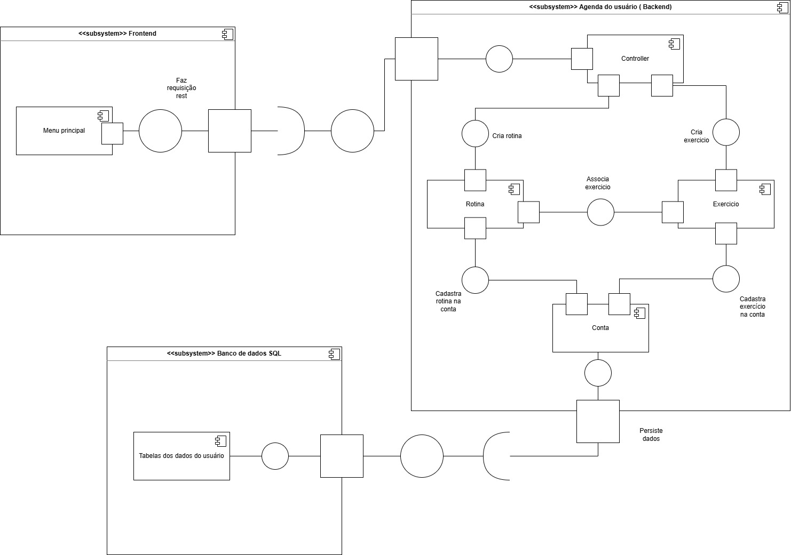
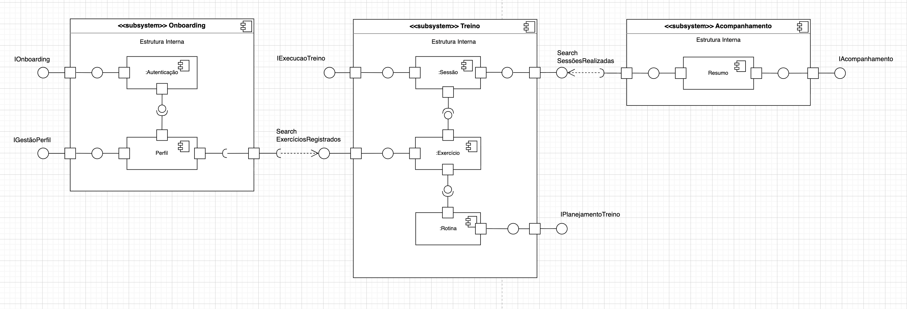
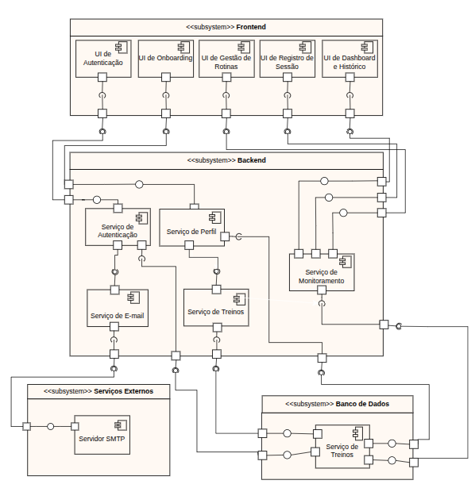
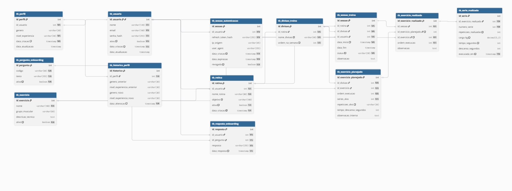
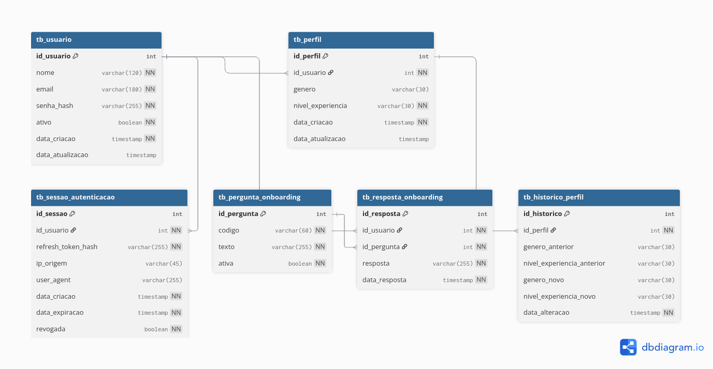
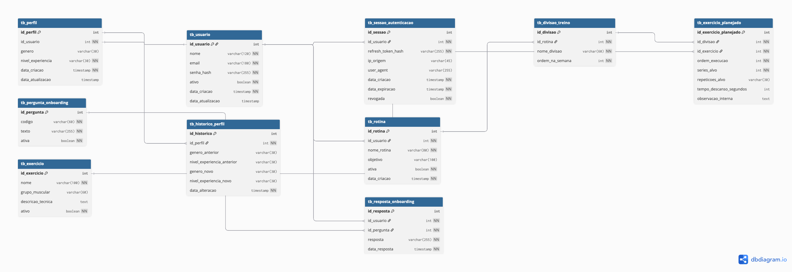
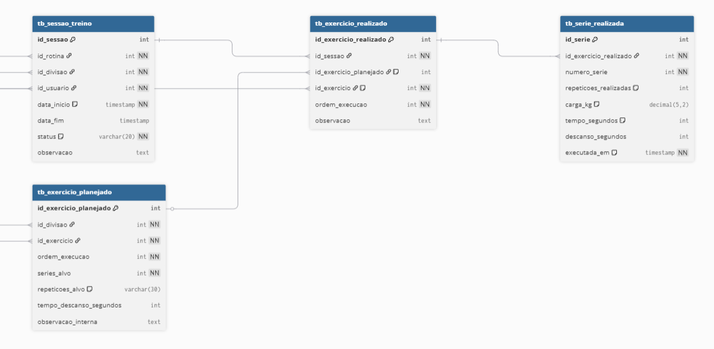

# 2.1. Modelagem Estática: Diagrama de Classes

## 1. Metodologia

Adotou-se o **Diagrama de Classes** por ser o artefato UML mais adequado para representar a estrutura estável de dados e os contratos de interface do sistema.

> **Nota Técnica sobre as Ferramentas de Modelagem:**
> Os diagramas apresentados nas subseções a seguir foram escritos e gerados utilizando a ferramenta PlantUML. Informa-se que todo o código-fonte UML foi devidamente submetido à análise de sintaxe pelo compilador do PlantUML, não tendo sido detectada nenhuma geração de erro ou inconsistência estrutural. Ademais, atesta-se que o processo de renderização originou diagramas visual e logicamente corretos, representando com exatidão os modelos arquiteturais pretendidos, sem apresentar distorções, anomalias de layout ou falhas de representação.

## 2. Introdução à Arquitetura do Sistema

Visando ao estabelecimento de uma base sólida que favoreça robustez, escalabilidade e manutenibilidade, este projeto adota os princípios e diretrizes da Arquitetura Limpa (_Clean Architecture_), conforme propostos por Robert C. Martin. Essa abordagem orienta a organização do sistema de forma a promover baixo acoplamento, alta coesão e independência de frameworks, facilitando a evolução e a sustentabilidade do software ao longo do tempo.

O objetivo central dessa abordagem reside na separação de responsabilidades. A organização do sistema em camadas concêntricas e isoladas assegura que as regras de negócio da aplicação permaneçam independentes de detalhes externos, tais como a interface do usuário (UI), o banco de dados e frameworks de terceiros. Como consequência, obtém-se uma arquitetura em que a infraestrutura é tratada como um elemento periférico, preservando o núcleo do negócio como componente central e protegido.

### 2.1. Princípios e a Regra de Dependência

A estrutura da Arquitetura Limpa fundamenta-se na **Regra de Dependência**, segundo a qual as dependências de código-fonte devem direcionar-se exclusivamente para o interior, em direção às políticas de mais alto nível. Nesse contexto, elementos pertencentes a camadas internas não devem, em hipótese alguma, depender ou ter conhecimento de componentes situados em camadas externas.

A arquitetura organiza-se nas seguintes camadas principais:

**Figura 1: Representação visual da Arquitetura Limpa. Fonte: Robert C. Martin.**

#### 2.1.1. Entidades (Enterprise Business Rules)

Correspondem à camada mais interna do sistema. São responsáveis por encapsular as regras de negócio essenciais e independentes do domínio, podendo ser implementadas por meio de objetos com comportamento ou estruturas de dados associadas a funções. Por sua natureza, constituem a parte mais estável do sistema, sendo pouco afetadas por mudanças em aspectos externos, como mecanismos de segurança, persistência ou interface.

#### 2.1.2. Casos de Uso (Application Business Rules)

Abrangem as regras de negócio específicas da aplicação e coordenam a interação entre as entidades. Essa camada define os fluxos de execução necessários para a realização das operações do sistema, assegurando que as regras de negócio sejam aplicadas de acordo com os objetivos de cada caso de uso.

#### 2.1.3. Adaptadores de Interface (Interface Adapters)

Responsáveis por realizar a mediação entre o núcleo da aplicação e os agentes externos. Incluem componentes como Controladores (_Controllers_), Apresentadores (_Presenters_) e Gateways, cuja função é converter dados entre os formatos internos (adequados aos Casos de Uso e Entidades) e os formatos exigidos por elementos externos, como interfaces de usuário e sistemas de persistência.

#### 2.1.4. Frameworks e Drivers (Frameworks & Drivers)

Configuram a camada mais externa da arquitetura, englobando tecnologias e ferramentas como frameworks web, bancos de dados, dispositivos e interfaces externas. Nessa camada, concentra-se predominantemente código de integração, necessário para viabilizar a comunicação com as camadas internas, mantendo-se a lógica de negócio isolada das dependências tecnológicas.

---

## 3. Detalhamento da Modelagem Estática (UML)

### 3.1. Diagrama de Classes

O diagrama de classes constitui um diagrama estático que consolida os elementos fundamentais de um sistema orientado a objetos, exibindo suas classes, interfaces e respectivos relacionamentos.

Na modelagem desenvolvida, cada classe reflete sua função correspondente nas camadas da Arquitetura Limpa. Para representar a inversão de dependência e a comunicação segura entre as camadas, aplicou-se:

- **Especificações de Acesso (Visibilidade):** Definição do escopo seguro por meio de atributos e métodos públicos (`+`), privados (`-`) e protegidos (`#`).
- **Relacionamentos Estruturais:** Mapeamento das interações mediante Dependência, Associação, Agregação e Composição.
- **Abstrações e Inversão de Controle:** Utilização de implementação de interfaces para assegurar que os casos de uso dependam de abstrações, em vez de implementações concretas de bancos de dados ou rotas web.

Devido à complexidade e à robustez do sistema, o diagrama de classes foi segmentado em cinco visões específicas. Essa separação visa facilitar a compreensão progressiva da arquitetura, avançando do panorama geral ao detalhamento metodológico de cada fronteira.

#### 3.1.1. Visão Geral da Arquitetura

Este diagrama exibe o panorama completo do sistema, ilustrando todas as camadas concêntricas estabelecidas pela Arquitetura Limpa: Entidades, Casos de Uso, Adaptadores de Interface (Controladores) e Frameworks/Banco de Dados. Observa-se a aplicação da Regra de Dependência, na qual o acoplamento flui das extremidades externas em direção ao centro (Casos de Uso e Entidades).

**Figura 2: Diagrama de Classes - Visão Geral da Arquitetura. Autor: Samuel Nogueira Caetano.**

#### 3.1.2. Visão do Domínio Core (Enterprise Business Rules)

Esta visão foca estritamente na camada mais interna da arquitetura, na qual residem as regras de negócio corporativas. Essas entidades independem de qualquer tecnologia de persistência ou interface de usuário. O modelo é estruturado em torno da entidade `Usuario` e subdivide-se metodicamente em três pilares principais de domínio: Planejamento (Rotinas e Divisões), Catálogo (Exercícios) e Execução (Sessões e Séries).

**Figura 3: Diagrama de Classes - Visão do Domínio Core. Autor: Samuel Nogueira Caetano.**

#### 3.1.3. Visão de Casos de Uso e Portas (Application Business Rules)

O diagrama detalha a camada de Aplicação, encarregada de orquestrar o fluxo de dados entre as entidades e o meio externo. Evidencia-se a adoção do padrão _Ports and Adapters_: os Casos de Uso (_Interactors_) implementam as Portas de Entrada (interfaces disponibilizadas aos Controladores) e consomem as Portas de Saída (interfaces de Repositórios). Dessa forma, assegura-se que as regras da aplicação se mantenham desvinculadas das especificidades da infraestrutura.

**Figura 4: Diagrama de Classes - Visão de Casos de Uso e Portas. Autor: Samuel Nogueira Caetano.**

#### 3.1.4. Visão de Controladores e Portas de Entrada

A modelagem concentra-se na fronteira de entrada do sistema (_Interface Adapters_), evidenciando a interação controlada entre a infraestrutura externa (como requisições HTTP) e os Controladores. Esses componentes atuam exclusivamente como orquestradores de fluxo, sendo responsáveis por receber requisições externas e acionar as abstrações das portas de entrada dos Casos de Uso, em conformidade com o princípio da responsabilidade única.

**Figura 5: Diagrama de Classes - Visão de Controladores e Portas de Entrada. Autor: Samuel Nogueira Caetano.**

#### 3.1.5. Visão de Repositórios e Inversão de Dependência

Este último diagrama detalha a fronteira de saída (_Frameworks & Drivers_). O foco incide estritamente sobre a Inversão de Dependência: as classes de implementação concreta de banco de dados (`Infrastructure`) realizam os contratos (Interfaces) definidos pela camada de Aplicação, sem ditar o formato dos dados. O fluxo assegura que as entidades de domínio trafeguem protegidas, sendo manipuladas de modo exclusivo por abstrações previamente acordadas e padronizadas.

**Figura 6: Diagrama de Classes - Visão de Repositórios e Inversão de Dependência. Autor: Samuel Nogueira Caetano.**

---

## 4. Diagrama de Implantação

**Figura 7: Diagrama de Implantação Física do Sistema. Autor: Daniel Teles.**

### 4.1. Definição e Propósito

O Diagrama de Implantação é um artefato da UML (Unified Modeling Language). Seu objetivo fundamental é descrever a topologia física do sistema, mapeando a distribuição de componentes de software (artefatos) em nós de hardware (dispositivos) e seus respectivos ambientes de execução.

Diferente de diagramas que focam na lógica ou no comportamento, o diagrama de implantação foca na infraestrutura, detalhando como o sistema será instalado e como as diferentes peças de hardware se comunicam entre si.

### 4.2. Aplicação ao Projeto

Para o sistema G7_MonitoreSeuTreino, o diagrama de implantação é crucial para validar a estratégia mobile-first. Como o sistema é uma aplicação web responsiva projetada para ser utilizada predominantemente em dispositivos móveis no ambiente de academia, a arquitetura de implantação foi desenhada para garantir:

- **Portabilidade:** Acesso via navegadores modernos sem necessidade de instalação nativa.
- **Escalabilidade:** Separação clara entre a entrega de conteúdo estático (Frontend) e o processamento de regras de negócio (Backend).
- **Segurança:** Isolamento do servidor de banco de dados, permitindo apenas conexões internas provenientes da aplicação.

### 4.3. Descrição da Arquitetura Proposta

O diagrama elaborado representa uma arquitetura de múltiplas camadas distribuída em quatro nós principais, detalhados a seguir:

#### 4.3.1. Nó: Dispositivo do Usuário (`<<device>> :User Device`)

Este nó representa o hardware final do cliente (smartphone ou desktop).

- **Ambiente de Execução:** `<<execution environment>> :Web Browser`. É dentro do navegador que o sistema ganha vida.
- **Artefato:** `<<artifact>> :React SPA Build`. Representa o código compilado do frontend que é carregado dinamicamente na memória do navegador.

#### 4.3.2. Nó: Servidor de Nuvem Frontend (`<<device>> :Frontend Cloud Server`)

Responsável pela hospedagem dos recursos estáticos.

- **Artefato:** `<<artifact>> :Compiled Static Files`. Contém os arquivos HTML, CSS, JS e imagens.
- **Protocolo de Comunicação:** O download desses arquivos pelo dispositivo do usuário ocorre via protocolo HTTPS, garantindo a integridade dos dados na entrega inicial.

#### 4.3.3. Nó: Servidor de Aplicação Backend (`<<device>> :Backend Application Server`)

Onde reside a inteligência do sistema.

- **Ambiente de Execução:** `<<execution environment>> :Node.js Runtime`.
- **Artefato:** `<<artifact>> :G7_API_Backend`. Representa a lógica de negócio escrita em TypeScript e compilada para execução.
- **Protocolo de Comunicação:** O frontend comunica-se com este nó via HTTPS / REST para operações de CRUD (Criar, Ler, Atualizar e Deletar) relacionadas aos treinos e históricos.

#### 4.3.4. Nó: Servidor de Banco de Dados (`<<device>> :Database Server`)

Nó dedicado exclusivamente à persistência.

- **Ambiente de Execução:** `<<execution environment>> :SGBD PostgreSQL`.
- **Artefato:** `<<artifact>> :G7_Database`. Representa o esquema do banco de dados e os dados persistidos dos usuários.
- **Protocolo de Comunicação:** A comunicação entre o Servidor de Aplicação e o Banco de Dados é realizada via TCP/IP, utilizando uma rede interna protegida.

## 5. Diagrama de Componentes

**Figura 8: Diagrama de Componentes - Estrutura Lógica de Módulos. Autor: Mateus Santos Negrini.**

### 5.1. Definição e Propósito

O Diagrama de Componentes é um artefato da UML (Unified Modeling Language) que tem como objetivo representar a organização e as dependências entre os componentes de software de um sistema.

Diferente do diagrama de implantação, que foca na infraestrutura física, o diagrama de componentes enfatiza a estrutura lógica da aplicação, evidenciando como os módulos são organizados, como se comunicam e quais responsabilidades cada um possui.

---

### 5.2. Aplicação ao Projeto

Para o sistema **G7_MonitoreSeuTreino**, o diagrama de componentes permite visualizar a separação clara entre as camadas da aplicação e a organização dos módulos responsáveis pelas principais funcionalidades, como gerenciamento de rotinas, exercícios e contas de usuário.

A modelagem adotada reforça:

- **Modularização:** Separação entre frontend, backend e persistência de dados.
- **Baixo acoplamento:** Comunicação entre componentes via interfaces bem definidas (requisições REST).
- **Alta coesão:** Cada componente possui responsabilidades específicas (ex: Controller, Rotina, Exercício, Conta).
- **Manutenibilidade:** Facilidade de evolução do sistema sem impacto global.

---

### 5.3. Descrição da Arquitetura Proposta

O diagrama está organizado em três grandes subsistemas: **Frontend**, **Backend (Agenda do usuário)** e **Banco de Dados SQL**.

---

#### 5.3.1. Componente: Frontend (`<<subsystem>> Frontend`)

Representa a interface com o usuário.

- **Responsabilidade:** Interação com o usuário e envio de requisições ao backend.
- **Componente interno:** `Menu principal`, responsável pela navegação do sistema.
- **Comunicação:** Realiza chamadas REST para o backend.

---

#### 5.3.2. Componente: Backend (`<<subsystem>> Agenda do usuário`)

Responsável pela lógica de negócio do sistema.

- **Controller:** Atua como ponto de entrada das requisições vindas do frontend, coordenando as operações.
- **Componente Rotina:**
  - Criação de rotinas de treino
  - Associação de exercícios às rotinas
- **Componente Exercício:**
  - Cadastro e gerenciamento de exercícios
- **Componente Conta:**
  - Gerenciamento dos dados do usuário
  - Associação de rotinas e exercícios à conta
- **Principais operações modeladas:**
  - Criar rotina
  - Criar exercício
  - Associar exercício à rotina
  - Cadastrar rotina/exercício na conta
- **Persistência:**
  - O backend é responsável por enviar os dados para armazenamento no banco de dados.

---

#### 5.3.3. Componente: Banco de Dados (`<<subsystem>> Banco de dados SQL`)

Responsável pela persistência das informações.

- **Componente interno:** `Tabelas dos dados do usuário`
- **Responsabilidade:** Armazenar dados de contas, rotinas e exercícios
- **Comunicação:** Recebe operações de persistência do backend

---

### 5.4. Fluxo Geral de Interação

1. O usuário interage com o **Frontend** (Menu principal).
2. O frontend realiza uma **requisição REST** ao **Controller** no backend.
3. O Controller delega a operação para os componentes adequados:
   - Rotina
   - Exercício
   - Conta
4. As operações podem envolver criação e associação de dados.
5. O backend realiza a **persistência dos dados** no banco SQL.

## 6. Diagrama de Componentes

### 6.1. Objetivo

Este diagrama apresenta a visão estrutural dos subsistemas do sistema, mostrando como o software se organiza em blocos maiores, os _subsystems_: **Onboarding**, **Treino** e **Acompanhamento**. Ele é adequado para representar a fronteira entre responsabilidades e interfaces no nível arquitetural, porque o diagrama de componentes da UML mostra componentes, interfaces fornecidas e requeridas, portas e relacionamentos entre eles. Na abordagem em subsistemas, procuramos enxergar a estrutura interna dos blocos principais e como eles se conectam. Dessa forma, o diagrama de componentes não descreve telas isoladas, mas sim os serviços centrais que o sistema expõe e consome internamente.

### 6.2. Diagrama

**Figura 9: Diagrama de Componentes - Visão por Serviços de Domínio. Autor: João Nascimento.**

### 6.3. Descrição

O subsistema **Onboarding** concentra os componentes responsáveis pela autenticação inicial e pela gestão do perfil do usuário. O subsistema **Treino** concentra a parte de planejamento e execução, reunindo exercício, rotina e sessão. O subsistema **Acompanhamento** consolida o resumo e a leitura da evolução do usuário.

As interfaces expostas por cada subsistema representam os serviços públicos que podem ser requisitados externamente. Assim, **Onboarding** oferece a entrada para autenticação e gestão de perfil; **Treino** oferece planejamento e execução de treino; e **Acompanhamento** oferece a consulta ao resumo. Internamente, o subsistema Treino reutiliza o componente Exercício como base compartilhada para a Rotina e para a Sessão, sem impor uma ligação direta obrigatória entre Rotina e Sessão, já que o domínio admite sessão avulsa e a relação sessão–rotina é opcional.

A estrutura do diagrama reflete uma aplicação em que o usuário primeiro se autentica e se classifica, depois passa a planejar ou executar seus treinos, e por fim consulta o acompanhamento. A escolha por poucas interfaces e por serviços mais amplos evita excesso de fragmentação e torna a leitura arquitetural mais clara. Em vez de expor cada classe do domínio como se fosse um serviço isolado, o diagrama mostra apenas as capacidades que realmente fazem sentido como fronteira de subsistema.

## 7. Diagrama de Componentes: Visão de Subsistemas e Interfaces

### 7.1. Objetivo

Este diagrama complementa as visões anteriores ao apresentar a arquitetura em um nível mais alto de abstração, dividindo o sistema em quatro grandes subsistemas: **Frontend**, **Backend**, **Serviços Externos** e **Banco de Dados**. O foco principal é ilustrar os componentes internos de cada subsistema e como eles se comunicam através de portas e interfaces bem definidas (fornecidas e requeridas), garantindo o baixo acoplamento e evidenciando o modelo cliente-servidor.

### 7.2. Diagrama

**Figura 10: Diagrama de Componentes - Visão de Portas e Interfaces. Autores: José Victor Gabriel & Eduardo Silva Waski.**

### 7.3. Descrição da Arquitetura

O modelo reforça a separação de responsabilidades da seguinte maneira:

- **Frontend:** Engloba as interfaces de usuário (UIs) segmentadas por contexto de uso da aplicação (UI de Autenticação, UI de Onboarding, UI de Gestão de Rotinas, UI de Registro de Sessão e UI de Dashboard e Histórico). Cada um desses componentes de UI consome serviços específicos expostos pelo backend.
- **Backend:** Centraliza a regra de negócio do sistema em serviços especializados (Serviço de Autenticação, Serviço de Perfil, Serviço de Treinos e Serviço de Monitoramento), além de um Serviço de E-mail responsável pela mensageira, o qual atua de forma interligada com os demais.
- **Serviços Externos:** Representa as integrações tecnológicas com ferramentas de terceiros, exemplificado neste escopo pelo `Servidor SMTP` consumido pelo Serviço de E-mail do backend para envio de notificações ou tokens.
- **Banco de Dados:** Representa a camada de persistência. O diagrama exibe conexões específicas, demonstrando que a base de dados só pode ser acessada de forma encapsulada através das portas do backend.

## 8. Diagrama de Banco de Dados

### 8.1. Metodologia

A modelagem do banco de dados foi elaborada a partir das entidades e responsabilidades identificadas na modelagem estática do sistema, mantendo alinhamento com a arquitetura proposta em camadas e com os princípios da Arquitetura Limpa. A persistência foi organizada de forma a preservar a separação entre regras de negócio, casos de uso e infraestrutura, conforme a estrutura já adotada no projeto. 

Para a representação do banco, adotou-se um modelo relacional, no qual as entidades do domínio foram convertidas em tabelas, seus atributos em colunas e seus relacionamentos em chaves primárias, chaves estrangeiras e restrições de integridade. O foco da modelagem foi garantir consistência, rastreabilidade e segurança dos dados persistidos.

### 8.2. Diagrama

O diagrama abaixo apresenta a visão consolidada de todas as entidades do banco de
dados do sistema **G7_MonitoreSeuTreino**, reunindo os três subdiagramas produzidos
pela equipe: Identidade e Perfil, Catálogo e Planejamento, e Execução e Métricas.

**Figura 10: Diagrama de Banco de dados — Visão geral das entidades e relacionamentos.
Autores: Lucas Antunes, Giovanni Dornelas e André Meyer.**

### 8.3. Objetivo

O objetivo do Diagrama de Banco de Dados é representar a estrutura de persistência do sistema **G7_MonitoreSeuTreino**, evidenciando como os dados das principais funcionalidades serão armazenados e relacionados.

Esse diagrama complementa a modelagem estática ao traduzir as entidades de domínio, casos de uso e necessidades de persistência em uma estrutura relacional concreta. Dessa forma, ele contribui para validar a consistência entre o modelo conceitual da aplicação e sua implementação em banco de dados.

### 8.4. Subdiagramas

#### 8.4.1. Identidade e Perfil

O subdiagrama de **Identidade e Perfil** contempla as tabelas responsáveis pelo cadastro, autenticação, classificação inicial e evolução do perfil do usuário. Esse recorte está diretamente relacionado ao subsistema de **Onboarding**, que concentra a autenticação inicial e a gestão do perfil do usuário. 

A tabela `tb_usuario` armazena os dados principais de identificação e acesso, como nome, e-mail, status da conta e hash da senha. A utilização do campo `senha_hash` reforça a segurança da aplicação, pois evita o armazenamento de senhas em texto puro.

A tabela `tb_perfil` mantém os dados complementares do usuário, como gênero e nível de experiência. A relação entre `tb_usuario` e `tb_perfil` é de um para um, garantida pela chave estrangeira única `id_usuario` em `tb_perfil`.

Também foram previstas tabelas auxiliares para ampliar a segurança e rastreabilidade do módulo: `tb_sessao_autenticacao`, responsável pelo controle de sessões e armazenamento de `refresh_token_hash`; `tb_pergunta_onboarding` e `tb_resposta_onboarding`, responsáveis por registrar o processo de onboarding; e `tb_historico_perfil`, que mantém o histórico de alterações realizadas no perfil do usuário.

**Figura 11: Diagrama de Banco de dados de identidade e perfil - Visão das entidades de identidade do banco. Autor: Lucas Antunes.**

#### 8.4.2. Catálogo e Planejamento

O subdiagrama de Catálogo e Planejamento detalha a estrutura de dados responsável por gerenciar o inventário de exercícios e a organização metodológica dos treinos dos usuários. Esse módulo materializa as definições de domínio do sistema, permitindo que o planejamento teórico seja estruturado de forma hierárquica e personalizada.

A tabela `tb_exercicio` atua como um catálogo global e independente, armazenando informações técnicas como nome, grupo muscular alvo. Essa centralização permite a reutilização de definições de exercícios por múltiplos usuários, garantindo a padronização dos dados.

A estruturação do plano de treino é encabeçada pela tabela `tb_rotina`, que está vinculada diretamente a tb_usuario. Ela representa o planejamento macro (ex: "Projeto Hipertrofia"), possuindo atributos para definir o objetivo e o status de ativação da rotina. Para resolver a complexidade da organização semanal, utilizou-se a tabela `tb_divisao_treino`, que segmenta a rotina em unidades menores (ex: Treino A, Treino B), permitindo a ordenação lógica dos dias de treinamento.

Por fim, a tabela `tb_exercicio_planejado` funciona como o elo de ligação entre o catálogo de exercícios e as divisões de treino. Ela é uma tabela associativa "enriquecida", pois não apenas relaciona as entidades, mas também armazena as metas de desempenho estabelecidas no planejamento, como ordem de execução, número de séries alvo, repetições previstas e tempo de descanso. Essa separação entre o "planejado" e o "executado" é fundamental para permitir a futura análise de progressão de carga e aderência ao treino.

**Figura 12: Diagrama de Banco de dados de catálogo e planejamento - Visão das entidades de identidade do banco. Autor: Giovanni Dornelas.**

#### 8.4.3. Execução e Métricas

O subdiagrama de **Execução e Métricas** contempla as tabelas responsáveis pelo
registro dinâmico das sessões de treino realizadas pelo usuário. Esse recorte está
diretamente relacionado ao subsistema de **acompanhamento**, que concentra a
execução prática dos treinos e a geração de dados para análise de progressão.

A tabela `tb_sessao_treino` representa cada ocorrência de treino realizado pelo
usuário, vinculando a sessão à rotina e à divisão planejada. Ela armazena o intervalo
de tempo da sessão (`data_inicio` e `data_fim`), o status de execução — podendo
ser `em_andamento`, `concluida` ou `cancelada` — e uma observação opcional.
A presença de `id_usuario` como chave estrangeira direta permite consultas eficientes
de histórico sem a necessidade de joins adicionais.

A tabela `tb_exercicio_realizado` registra cada exercício executado dentro de uma
sessão. Para garantir a rastreabilidade, ela referencia `id_exercicio_planejado`
quando o exercício faz parte da rotina previamente definida. No entanto, o campo
`id_exercicio_planejado` é nullable, o que permite que o usuário adicione exercícios
livres durante a sessão — nesse caso, apenas `id_exercicio` é obrigatório, garantindo
que o exercício realizado seja sempre identificável independentemente de ter sido
planejado ou não.

Por fim, a tabela `tb_serie_realizada` representa a unidade mínima de registro do
treino: cada série executada. Ela armazena os dados reais de desempenho —
`repeticoes_realizadas`, `carga_kg` e `tempo_segundos` — todos definidos como
nullable, pois o preenchimento de cada campo depende da natureza do exercício.
Exercícios baseados em repetições registram carga e repetições; exercícios aeróbicos
ou isométricos registram tempo. Essa flexibilidade garante que o modelo suporte
diferentes modalidades sem redundância estrutural. O campo `executada_em` permite
ainda rastrear o momento exato de cada série, viabilizando análises temporais de
desempenho no futuro.

**Figura 13: Diagrama de Banco de dados de execução e métricas — Visão das
entidades de execução e acompanhamento do banco. Autor: André Meyer.**

## 9. Rastreabilidade e Elos com Outros Artefatos

O diagrama de classes não é isolado; ele materializa definições de documentos anteriores:

- **Léxico:** As entidades `Sessao`, `Rotina` e `Exercicio` mapeiam diretamente os termos definidos no **Léxico** do projeto.
- **Backlog do Produto:** A estrutura de métodos e controllers foi projetada para suportar os requisitos funcionais de registro e acompanhamento de progresso.
- **Protótipo:** A separação dos controladores reflete as visões de monitoramento e gestão de rotinas desenhadas no protótipo.

O mesmo vale para o diagrama de componentes; cada subsistema engloba um conjunto de requisitos que já haviam sido estabelecidos no backlog do produto. Além do mais, os diagramas de sequência e o material de arquitetura também reforçam essa rastreabilidade. Enquanto o primeiro demonstra o fluxo de execução de uma sessão e suas validações, o segundo mostra a separação entre entidades, casos de uso, adaptadores e infraestrutura. Assim, o diagrama de componentes atua como ponte entre a visão estática do domínio e a visão dinâmica do comportamento do sistema.

## 10. Análise Crítica (Senso Crítico)

### 10.1. Perspectiva do Autor (Samuel Nogueira Caetano)

Sobre a elaboração dos Diagramas de Classes presentes neste documento, ressalta-se que a utilização do PlantUML não foi um processo de geração automática desprovido de reflexão. Pelo contrário, a escolha do “Diagrama como Código” permitiu que a estrutura fosse construída com foco na lógica arquitetural e não apenas na estética visual.

Todo o mapeamento das relações de dependência, a separação em camadas da Clean Architecture e a definição rigorosa de visibilidade e contratos de interface foram decisões de projeto pensadas ativamente para garantir que o modelo representasse fielmente o sistema planejado. O uso da ferramenta foi um meio técnico para expressar o senso crítico sobre a inversão de dependência e o desacoplamento, assegurando que o núcleo do domínio permanecesse isolado e protegido de interferências externas.

### 10.2. Perspectiva Geral do Grupo

### 9.1. Perspectiva do Autor (Samuel Nogueira Caetano)

Sobre a elaboração dos Diagramas de Classes presentes neste documento, ressalta-se que a utilização do PlantUML não foi um processo de geração automática desprovido de reflexão. Pelo contrário, a escolha do “Diagrama como Código” permitiu que a estrutura fosse construída com foco na lógica arquitetural e não apenas na estética visual.

Todo o mapeamento das relações de dependência, a separação em camadas da Clean Architecture e a definição rigorosa de visibilidade e contratos de interface foram decisões de projeto pensadas ativamente para garantir que o modelo representasse fielmente o sistema planejado. O uso da ferramenta foi um meio técnico para expressar o senso crítico sobre a inversão de dependência e o desacoplamento, assegurando que o núcleo do domínio permanecesse isolado e protegido de interferências externas.

### 9.2. Perspectiva Geral do Grupo

A adoção da Arquitetura Limpa garantiu um alto nível de testabilidade e isolamento das regras de negócio. Entretanto, a equipe observou que essa estrutura impõe um custo inicial de complexidade, exigindo o uso intensivo de interfaces e DTOs (_Data Transfer Objects_) para trafegar dados entre as camadas sem violar a regra de dependência. A segmentação em cinco visões foi essencial para permitir que o grupo trabalhasse de forma paralela sem perder a coesão do modelo geral.

Mesmo assim, isso não impediu de mostrar maior mérito diagrama de componentes, que é mostrar que o sistema não é um conjunto de funcionalidades desconexas, mas sim uma arquitetura orientada a serviços de domínio. A separação entre Onboarding, Treino e Acompanhamento reduz dependências desnecessárias e ajuda a manter a coesão interna de cada subsistema. Em UML, isso é exatamente o tipo de problema que o diagrama de componentes resolve: visualizar componentes, interfaces e relações de dependência entre blocos de software.

## 11. Referências

1. SERRANO, Milene. **Arquitetura e Desenho de Software - Aula Modelagem UML Estática**.
2. MARTIN, Robert C. **Clean Architecture: A Craftsman’s Guide to Software Structure and Design**. Prentice Hall, 2017.
3. G7_MonitoreSeuTreino. **Documentação de Base (Léxico, Backlog e Protótipo)**.
4. OBJECT MANAGEMENT GROUP (OMG). **OMG Unified Modeling Language (OMG UML)**. Version 2.5.1. Needham: OMG, 2017. Disponível em: https://www.omg.org/spec/UML/2.5.1/PDF. Acesso em: 23 abr. 2026.
5. UML DIAGRAMS. **UML Diagrams: Unified Modeling Language.** Disponível em: https://www.uml-diagrams.org/. Acesso em: 23 abr. 2026.

## Histórico de Versão

|  **Data**  | **Versão** | **Descrição**                                                                                               |          **Autor**           |           **Revisor**            |
|:----------:|:----------:|:------------------------------------------------------------------------------------------------------------|:----------------------------:|:--------------------------------:|
| 21/04/2026 |    1.0     | Elaboração do script PlantUML e fluxos descritivos.                                                         |        Samuel Caetano        | Lucas Antunes, Giovanni Dornelas |
| 21/04/2026 |    1.1     | Adição das seções 1 a 6                                                                                     |        Samuel Caetano        | Lucas Antunes, Giovanni Dornelas |
| 23/04/2026 |    1.2     | Adição do diagrama de implantação                                                                           |         Daniel Teles         |          Eduardo Waski           |
| 23/04/2026 |    1.3     | Adicionada referência                                                                                       |         Daniel Teles         |          Eduardo Waski           |
| 23/04/2026 |    1.4     | Adicionado diagrama de componentes                                                                          |    Mateus Santos Negrini     |                -                 |
| 24/04/2026 |    1.5     | Adição do Diagrama de Componentes e o detalhamento desse diagrama                                           | João Nascimento, José Victor |   André Meyer, Mateus Negrini    |
| 24/04/2026 |    1.6     | Adicionando uma nova versão do diagrama de componentes                                                      | José Victor & Eduardo Waski  |                -                 |
| 24/04/2026 |    1.7     | Padronização de legendas, autoria e inclusão de senso crítico personalizado.                                |        Samuel Caetano        |                -                 |
| 24/04/2026 |    1.8     | Adição do Diagrama de Banco de Dados, incluindo metodologia, objetivo e subdiagrama de Identidade e Perfil. |        Lucas Antunes         |                -                 |
| 24/04/2026 |    1.9     | Adição do Diagrama de Banco de Dados e subdiagrama de Catálogo e Planejamento. |        Giovanni Dornelas         |                -                 |
| 24/04/2026 |    1.10     | Adição do Diagrama de Banco de Dados e subdiagrama de Execução e Métricas. |        André Meyer          |                -                 |
