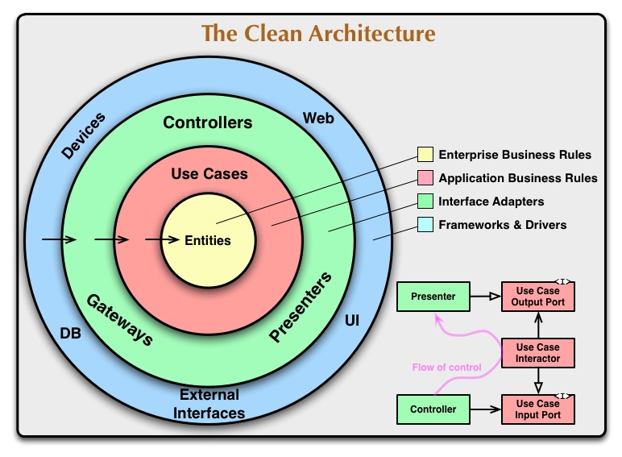
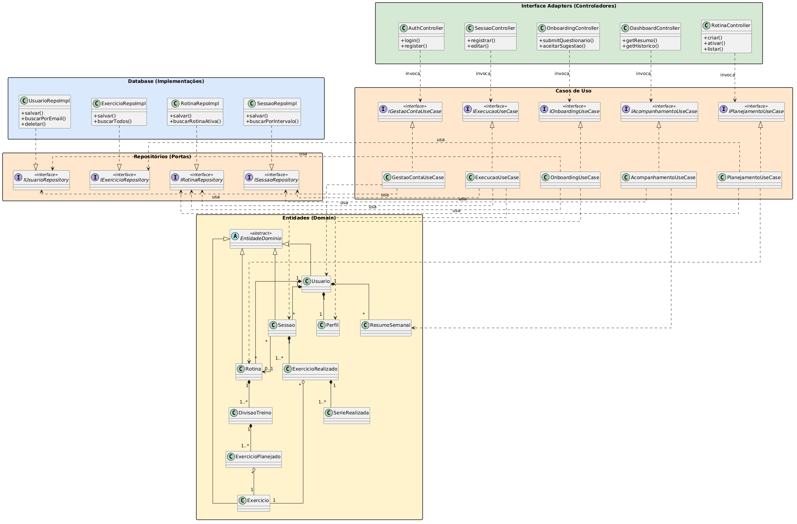
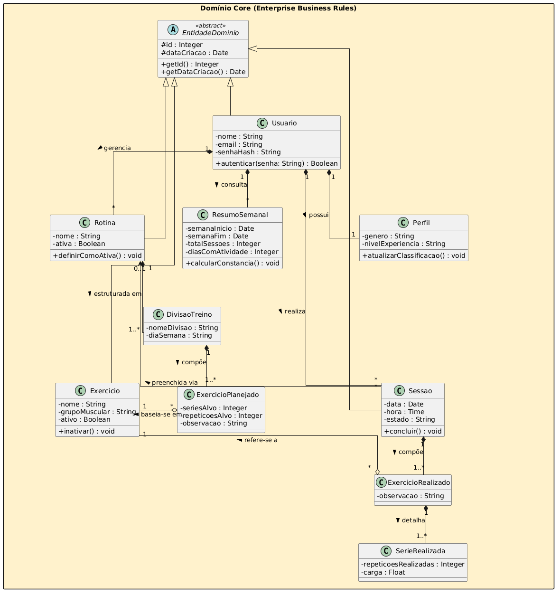
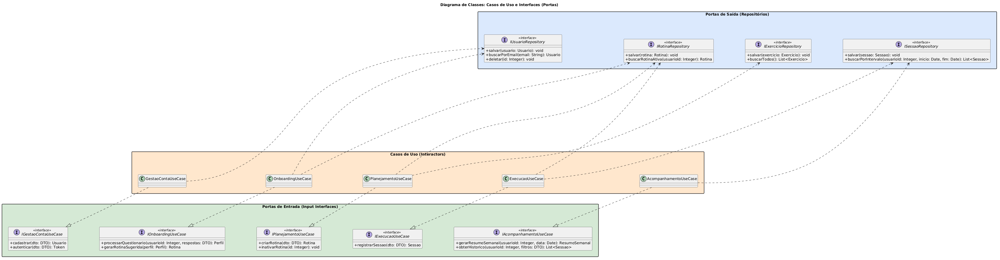
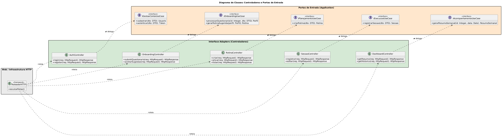
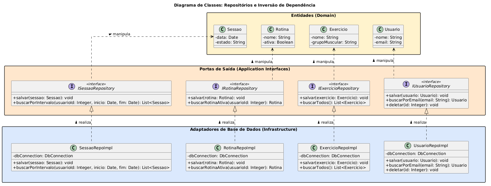
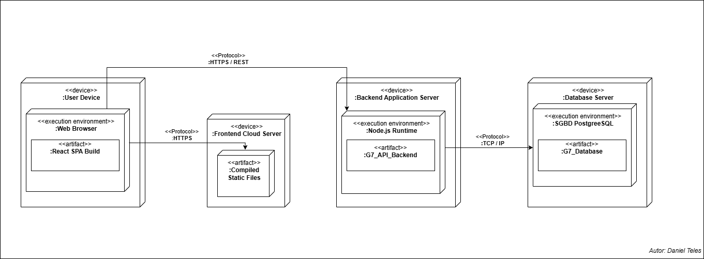

# 2.1. Modelagem Estática: Diagrama de Classes

## 1. Metodologia

Adotou-se o **Diagrama de Classes** por ser o artefato UML mais adequado para representar a estrutura estável de dados e os contratos de interface do sistema.

> **Nota Técnica sobre as Ferramentas de Modelagem:**
> Os diagramas apresentados nas subseções a seguir foram escritos e gerados utilizando a ferramenta PlantUML. Informa-se que todo o código-fonte UML foi devidamente submetido à análise de sintaxe pelo compilador do PlantUML, não tendo sido detectada nenhuma geração de erro ou inconsistência estrutural. Ademais, atesta-se que o processo de renderização originou diagramas visual e logicamente corretos, representando com exatidão os modelos arquiteturais pretendidos, sem apresentar distorções, anomalias de layout ou falhas de representação.

## 2. Introdução à Arquitetura do Sistema

Visando ao estabelecimento de uma base sólida que favoreça robustez, escalabilidade e manutenibilidade, este projeto adota os princípios e diretrizes da Arquitetura Limpa (_Clean Architecture_), conforme propostos por Robert C. Martin. Essa abordagem orienta a organização do sistema de forma a promover baixo acoplamento, alta coesão e independência de frameworks, facilitando a evolução e a sustentabilidade do software ao longo do tempo.

O objetivo central dessa abordagem reside na separação de responsabilidades. A organização do sistema em camadas concêntricas e isoladas assegura que as regras de negócio da aplicação permaneçam independentes de detalhes externos, tais como a interface do usuário (UI), o banco de dados e frameworks de terceiros. Como consequência, obtém-se uma arquitetura em que a infraestrutura é tratada como um elemento periférico, preservando o núcleo do negócio como componente central e protegido.

### 2.1. Princípios e a Regra de Dependência

A estrutura da Arquitetura Limpa fundamenta-se na **Regra de Dependência**, segundo a qual as dependências de código-fonte devem direcionar-se exclusivamente para o interior, em direção às políticas de mais alto nível. Nesse contexto, elementos pertencentes a camadas internas não devem, em hipótese alguma, depender ou ter conhecimento de componentes situados em camadas externas.

A arquitetura organiza-se nas seguintes camadas principais:

#### 2.1.1. Entidades (Enterprise Business Rules)

Correspondem à camada mais interna do sistema. São responsáveis por encapsular as regras de negócio essenciais e independentes do domínio, podendo ser implementadas por meio de objetos com comportamento ou estruturas de dados associadas a funções. Por sua natureza, constituem a parte mais estável do sistema, sendo pouco afetadas por mudanças em aspectos externos, como mecanismos de segurança, persistência ou interface.

#### 2.1.2. Casos de Uso (Application Business Rules)

Abrangem as regras de negócio específicas da aplicação e coordenam a interação entre as entidades. Essa camada define os fluxos de execução necessários para a realização das operações do sistema, assegurando que as regras de negócio sejam aplicadas de acordo com os objetivos de cada caso de uso.

#### 2.1.3. Adaptadores de Interface (Interface Adapters)

Responsáveis por realizar a mediação entre o núcleo da aplicação e os agentes externos. Incluem componentes como Controladores (_Controllers_), Apresentadores (_Presenters_) e Gateways, cuja função é converter dados entre os formatos internos (adequados aos Casos de Uso e Entidades) e os formatos exigidos por elementos externos, como interfaces de usuário e sistemas de persistência.

#### 2.1.4. Frameworks e Drivers (Frameworks & Drivers)

Configuram a camada mais externa da arquitetura, englobando tecnologias e ferramentas como frameworks web, bancos de dados, dispositivos e interfaces externas. Nessa camada, concentra-se predominantemente código de integração, necessário para viabilizar a comunicação com as camadas internas, mantendo-se a lógica de negócio isolada das dependências tecnológicas.

---

## 3. Detalhamento da Modelagem Estática (UML)

### 3.1. Diagrama de Classes

O diagrama de classes constitui um diagrama estático que consolida os elementos fundamentais de um sistema orientado a objetos, exibindo suas classes, interfaces e respectivos relacionamentos.

Na modelagem desenvolvida, cada classe reflete sua função correspondente nas camadas da Arquitetura Limpa. Para representar a inversão de dependência e a comunicação segura entre as camadas, aplicou-se:

- **Especificações de Acesso (Visibilidade):** Definição do escopo seguro por meio de atributos e métodos públicos (`+`), privados (`-`) e protegidos (`#`).
- **Relacionamentos Estruturais:** Mapeamento das interações mediante Dependência, Associação, Agregação e Composição.
- **Abstrações e Inversão de Controle:** Utilização de implementação de interfaces para assegurar que os casos de uso dependam de abstrações, em vez de implementações concretas de bancos de dados ou rotas web.

Devido à complexidade e à robustez do sistema, o diagrama de classes foi segmentado em cinco visões específicas. Essa separação visa facilitar a compreensão progressiva da arquitetura, avançando do panorama geral ao detalhamento metodológico de cada fronteira.

#### 3.1.1. Visão Geral da Arquitetura

Este diagrama exibe o panorama completo do sistema, ilustrando todas as camadas concêntricas estabelecidas pela Arquitetura Limpa: Entidades, Casos de Uso, Adaptadores de Interface (Controladores) e Frameworks/Banco de Dados. Observa-se a aplicação da Regra de Dependência, na qual o acoplamento flui das extremidades externas em direção ao centro (Casos de Uso e Entidades).

#### 3.1.2. Visão do Domínio Core (Enterprise Business Rules)

Esta visão foca estritamente na camada mais interna da arquitetura, na qual residem as regras de negócio corporativas. Essas entidades independem de qualquer tecnologia de persistência ou interface de usuário. O modelo é estruturado em torno da entidade `Usuario` e subdivide-se metodicamente em três pilares principais de domínio: Planejamento (Rotinas e Divisões), Catálogo (Exercícios) e Execução (Sessões e Séries).

#### 3.1.3. Visão de Casos de Uso e Portas (Application Business Rules)

O diagrama detalha a camada de Aplicação, encarregada de orquestrar o fluxo de dados entre as entidades e o meio externo. Evidencia-se a adoção do padrão _Ports and Adapters_: os Casos de Uso (_Interactors_) implementam as Portas de Entrada (interfaces disponibilizadas aos Controladores) e consomem as Portas de Saída (interfaces de Repositórios). Dessa forma, assegura-se que as regras da aplicação se mantenham desvinculadas das especificidades da infraestrutura.

#### 3.1.4. Visão de Controladores e Portas de Entrada

A modelagem concentra-se na fronteira de entrada do sistema (_Interface Adapters_), evidenciando a interação controlada entre a infraestrutura externa (como requisições HTTP) e os Controladores. Esses componentes atuam exclusivamente como orquestradores de fluxo, sendo responsáveis por receber requisições externas e acionar as abstrações das portas de entrada dos Casos de Uso, em conformidade com o princípio da responsabilidade única.

#### 3.1.5. Visão de Repositórios e Inversão de Dependência

Este último diagrama detalha a fronteira de saída (_Frameworks & Drivers_). O foco incide estritamente sobre a Inversão de Dependência: as classes de implementação concreta de banco de dados (`Infrastructure`) realizam os contratos (Interfaces) definidos pela camada de Aplicação, sem ditar o formato dos dados. O fluxo assegura que as entidades de domínio trafeguem protegidas, sendo manipuladas de modo exclusivo por abstrações previamente acordadas e padronizadas.

## 4. Diagrama de Implantação

### 4.1. Definição e Propósito

O Diagrama de Implantação é um artefato da UML (Unified Modeling Language). Seu objetivo fundamental é descrever a topologia física do sistema, mapeando a distribuição de componentes de software (artefatos) em nós de hardware (dispositivos) e seus respectivos ambientes de execução.

Diferente de diagramas que focam na lógica ou no comportamento, o diagrama de implantação foca na infraestrutura, detalhando como o sistema será instalado e como as diferentes peças de hardware se comunicam entre si.

### 4.2. Aplicação ao Projeto

Para o sistema G7_MonitoreSeuTreino, o diagrama de implantação é crucial para validar a estratégia mobile-first. Como o sistema é uma aplicação web responsiva projetada para ser utilizada predominantemente em dispositivos móveis no ambiente de academia, a arquitetura de implantação foi desenhada para garantir:

- **Portabilidade:** Acesso via navegadores modernos sem necessidade de instalação nativa.
- **Escalabilidade:** Separação clara entre a entrega de conteúdo estático (Frontend) e o processamento de regras de negócio (Backend).
- **Segurança:** Isolamento do servidor de banco de dados, permitindo apenas conexões internas provenientes da aplicação.

### 4.3. Descrição da Arquitetura Proposta

O diagrama elaborado representa uma arquitetura de múltiplas camadas distribuída em quatro nós principais, detalhados a seguir:

#### 4.3.1. Nó: Dispositivo do Usuário (`<<device>> :User Device`)

Este nó representa o hardware final do cliente (smartphone ou desktop).

- **Ambiente de Execução:** `<<execution environment>> :Web Browser`. É dentro do navegador que o sistema ganha vida.
- **Artefato:** `<<artifact>> :React SPA Build`. Representa o código compilado do frontend que é carregado dinamicamente na memória do navegador.

#### 4.3.2. Nó: Servidor de Nuvem Frontend (`<<device>> :Frontend Cloud Server`)

Responsável pela hospedagem dos recursos estáticos.

- **Artefato:** `<<artifact>> :Compiled Static Files`. Contém os arquivos HTML, CSS, JS e imagens.
- **Protocolo de Comunicação:** O download desses arquivos pelo dispositivo do usuário ocorre via protocolo HTTPS, garantindo a integridade dos dados na entrega inicial.

#### 4.3.3. Nó: Servidor de Aplicação Backend (`<<device>> :Backend Application Server`)

Onde reside a inteligência do sistema.

- **Ambiente de Execução:** `<<execution environment>> :Node.js Runtime`.
- **Artefato:** `<<artifact>> :G7_API_Backend`. Representa a lógica de negócio escrita em TypeScript e compilada para execução.
- **Protocolo de Comunicação:** O frontend comunica-se com este nó via HTTPS / REST para operações de CRUD (Criar, Ler, Atualizar e Deletar) relacionadas aos treinos e históricos.

#### 4.3.4. Nó: Servidor de Banco de Dados (`<<device>> :Database Server`)

Nó dedicado exclusivamente à persistência.

- **Ambiente de Execução:** `<<execution environment>> :SGBD PostgreSQL`.
- **Artefato:** `<<artifact>> :G7_Database`. Representa o esquema do banco de dados e os dados persistidos dos usuários.
- **Protocolo de Comunicação:** A comunicação entre o Servidor de Aplicação e o Banco de Dados é realizada via TCP/IP, utilizando uma rede interna protegida.

## 5. Rastreabilidade e Elos com Outros Artefatos

O diagrama de classes não é isolado; ele materializa definições de documentos anteriores:

- **Léxico:** As entidades `Sessao`, `Rotina` e `Exercicio` mapeiam diretamente os termos definidos no **Léxico** do projeto.
- **Backlog do Produto:** A estrutura de métodos e controllers foi projetada para suportar os requisitos funcionais de registro e acompanhamento de progresso.
- **Protótipo:** A separação dos controladores reflete as visões de monitoramento e gestão de rotinas desenhadas no protótipo.

## 6. Análise Crítica (Senso Crítico)

A adoção da Arquitetura Limpa garantiu um alto nível de testabilidade e isolamento das regras de negócio. Entretanto, a equipe observou que essa estrutura impõe um custo inicial de complexidade, exigindo o uso intensivo de interfaces e DTOs (_Data Transfer Objects_) para trafegar dados entre as camadas sem violar a regra de dependência. A segmentação em cinco visões foi essencial para permitir que o grupo trabalhasse de forma paralela sem perder a coesão do modelo geral.

## 6. Referências

1. SERRANO, Milene. **Arquitetura e Desenho de Software - Aula Modelagem UML Estática**.
2. MARTIN, Robert C. **Clean Architecture: A Craftsman’s Guide to Software Structure and Design**. Prentice Hall, 2017.
3. G7_MonitoreSeuTreino. **Documentação de Base (Léxico, Backlog e Protótipo)**.
4. OBJECT MANAGEMENT GROUP (OMG). **OMG Unified Modeling Language (OMG UML)**. Version 2.5.1. Needham: OMG, 2017. Disponível em: https://www.omg.org/spec/UML/2.5.1/PDF. Acesso em: 23 abr. 2026.
5. UML DIAGRAMS. **UML Diagrams: Unified Modeling Language.** Disponível em: https://www.uml-diagrams.org/. Acesso em: 23 abr. 2026.

## Histórico de Versão

|  **Data**  | **Versão** | **Descrição**                                       |   **Autor**    | **Revisor** |
| :--------: | :--------: | :-------------------------------------------------- | :------------: | :---------: |
| 21/04/2026 |    1.0     | Elaboração do script PlantUML e fluxos descritivos. | Samuel Caetano |      -      |
| 21/04/2026 |    1.1     | Adição das seções 1 a 6                             | Samuel Caetano |      -      |
| 23/04/2026 |    1.2     | Adição do diagrama de implantação                             | Daniel Teles |      -      |
| 23/04/2026 |    1.3     | Adicionada referência                           | Daniel Teles |      -      |
