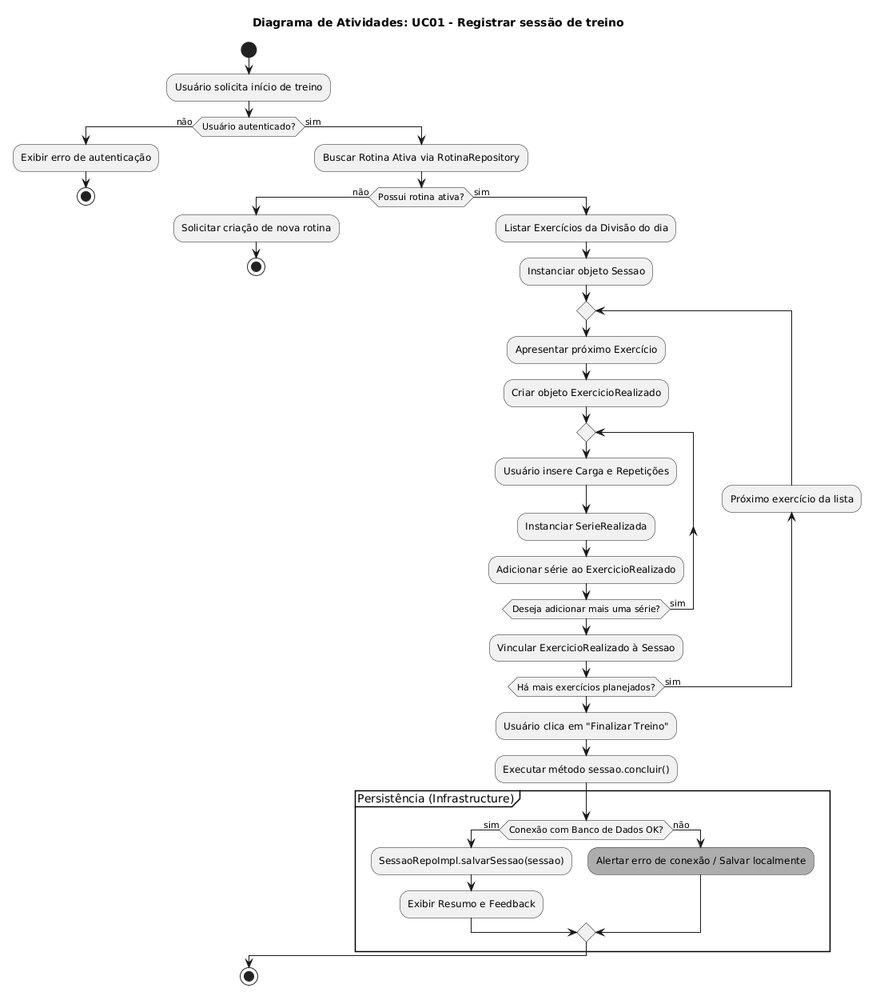

# 2.2. Modelagem Dinâmica

## 1. Metodologia

A modelagem dinâmica do projeto foi concebida para detalhar o comportamento do sistema em tempo de execução. Para uma compreensão completa do UC01 - Registrar Sessão de Treino, a equipe utilizou quatro perspectivas complementares da UML:

- Diagrama de Sequência: Focado na interação temporal e troca de mensagens entre os componentes da Clean Architecture.

- Diagrama de Atividades: Focado na lógica procedural, fluxos de decisão e iterações (loops) de séries e exercícios.

- Diagrama de Colaboração: ...

- Diagrama de Estados: ...

## 2. Diagrama de Sequência

### 2.1. Objetivo

Este diagrama descreve as interações dinâmicas e o fluxo de mensagens entre o usuário, a interface e os componentes internos da arquitetura (Controladores, Casos de Uso, Entidades e Repositórios) durante o processo de registro de uma sessão de treino no sistema.

### 2.2. Atores e Componentes (Linhas de Vida)

O diagrama mapeia as seguintes linhas de vida, respeitando as fronteiras da Arquitetura Limpa:

- **Ator Principal:**
  - `Usuário` (User): O praticante que está registrando o treino.
- **Fronteira (Boundary / UI):**
  - `SessaoUI`: A interface gráfica com a qual o usuário interage.
- **Controles (Control):**
  - `SessaoController`: Responsável por receber as requisições (HTTP GET/POST) da UI e orquestrar as chamadas para a camada de negócio.
  - `ExecucaoUseCase`: O caso de uso que contém as regras de negócio de como uma sessão de treino deve ser criada, validada e salva.
- **Entidades (Entity):**
  - `Sessao`, `ExercicioRealizado`, `SerieRealizada`: Objetos de domínio instanciados durante a execução do treino.
- **Repositórios (Database / Infraestrutura):**
  - `IRotinaRepository`: Interface de acesso aos dados de rotinas de treino.
  - `ISessaoRepository`: Interface de acesso responsável por persistir os dados do registro da sessão.

---

### 2.3. Descrição do Fluxo de Eventos

O diagrama está estruturado em três fases principais de execução:

#### 2.3.1. Fase 1: Preparação e Carregamento

1. O `Usuário` acessa a interface (`SessaoUI`) acionando a opção de registrar uma nova sessão.
2. A interface solicita os dados iniciais via método GET ao `SessaoController`.
3. O controlador repassa a solicitação ao `ExecucaoUseCase` passando o ID do usuário (`usuarioId`).
4. O `ExecucaoUseCase` busca no repositório `IRotinaRepository` se existe alguma rotina ativa vinculada àquele usuário.
   - **Fluxo Principal (Rotina Ativa Encontrada):** O repositório retorna a entidade da rotina. O caso de uso mapeia esses dados em um DTO (_Data Transfer Object_) contendo os exercícios e parâmetros planejados, e envia para o controlador. O controlador repassa à interface, que apresenta os campos **pré-preenchidos** para o usuário.
   - **Fluxo Alternativo (FA01 - Sessão Avulsa):** Caso não seja encontrada nenhuma rotina ativa, o repositório retorna nulo/vazio. O caso de uso constrói um DTO vazio, e a interface disponibiliza um formulário em branco para que o usuário faça a **seleção manual** dos exercícios.

#### 2.3.2. Fase 2: Registro de Execução

5. O `Usuário` interage com a interface (`SessaoUI`) e insere suas métricas reais do treino, informando as séries, as repetições realizadas e a carga utilizada.
6. O `Usuário` preenche o campo de observações (ação opcional).
7. O `Usuário` clica no botão para finalizar o registro (ação de _Submit_).

#### 2.3.3. Fase 3: Validação e Persistência

8. A `SessaoUI` reúne os dados informados, empacota em um DTO estruturado e os envia via requisição POST ao `SessaoController`.
9. O controlador chama o método de processar registro do `ExecucaoUseCase` passando os dados.
10. O `ExecucaoUseCase` mapeia o DTO e instancia as entidades puras de domínio (`Sessao`, `ExercicioRealizado` e `SerieRealizada`).
11. Em seguida, o caso de uso aplica validações de regras de negócio em cima das entidades instanciadas (Exemplo: verifica se a carga e o número de repetições são maiores que zero).
    - **Fluxo Principal (Validação bem-sucedida):** As entidades confirmam que os dados são válidos. O `ExecucaoUseCase` define o estado interno da `Sessao` como “concluída” e aciona o `ISessaoRepository` para salvar as informações no banco de dados. Após a confirmação de persistência, o controlador devolve um status de sucesso (Ex: HTTP 201 Created), e a interface **redireciona** o usuário para a tela de Histórico ou Resumo Semanal.
    - **Fluxo de Exceção (FE01 - Falha na Validação):** As entidades indicam inconsistência nos dados (ex: campos faltando ou negativos) e lançam uma exceção de validação. O `ExecucaoUseCase` interrompe o processo de salvamento imediatamente e propaga o erro. O controlador retorna uma notificação de erro (Ex: HTTP 400 Bad Request) para a `SessaoUI`, que exibe alertas visuais específicos na tela orientando o usuário a corrigir as métricas antes de tentar novamente.

---

## 3. Diagrama de Atividades

### 3.1 Objetivo

Complementar a visão de sequência ao detalhar a lógica interna dos laços de repetição (séries/exercícios) e os desvios condicionais de validação, garantindo que o fluxo de controle seja compreendido tanto no "caminho feliz" quanto nos fluxos de exceção.

### 3.2 Descrição dos Elementos Lógicos

Laços Aninhados: Diferente do sequencial, aqui fica explícito que para cada ExercicioRealizado, existem múltiplas SerieRealizada, refletindo a composição do Diagrama de Classes.

Partição de Infraestrutura: Isola o momento em que o fluxo de controle sai das Regras de Negócio e atinge o SessaoRepoImpl

## 4. Rastreabilidade e Elos com Outros Artefatos

Os Diagramas interligam diversos modelos concebidos anteriormente no projeto:

- **Diagrama de Classes:** As ações de "Instanciar" e "Salvar" utilizam as entidades Sessao, ExercicioRealizado e SerieRealizada e a interface ISessaoRepository.
- **Casos de Uso:** Ambos detalham o UC01 - Registrar Sessão de Treino.
- **Protótipo:** As fases de interação do ator com a fronteira (`SessaoUI`) validam a navegação estipulada nas telas de acompanhamento de treino do protótipo de alta fidelidade.
- **Clean Architecture:** Respeitam a Regra de Dependência, onde o fluxo de controle pode cruzar camadas, mas a dependência de código aponta para o centro (Casos de Uso e Entidades).

## 5. Análise Crítica (Senso Crítico)

A modelagem dinâmica do registro de treino evidenciou a importância de aplicar a inversão de dependência em tempo de execução. Ao utilizar abstrações (`IRotinaRepository` e `ISessaoRepository`) no diagrama de sequência, fica comprovado que o `ExecucaoUseCase` não depende de implementações concretas de infraestrutura.

Identificou-se também que delegar a responsabilidade de validação final para as Entidades (Fase 3, passo 11) impede que dados inconsistentes cheguem ao repositório, garantindo a integridade do domínio. O uso dos blocos `alt` no PlantUML provou-se fundamental para mapear as variações de percurso (como a ausência de rotina ativa - FA01), garantindo que a equipe de desenvolvimento tenha clareza sobre o comportamento esperado da API em cenários de erro.

## 6. Referências

1. SERRANO, Milene. **Arquitetura e Desenho de Software - Aula Modelagem UML Dinâmica**.
2. G7_MonitoreSeuTreino. **Documentação de Diagrama de Classes e Casos de Uso**.

## Histórico de Versão

|  **Data**  | **Versão** | **Descrição**                                       |   **Autor**    | **Revisor** |
| :--------: | :--------: | :-------------------------------------------------- | :------------: | :---------: |
| 21/04/2026 |    1.0     | Elaboração do script PlantUML e fluxos descritivos. | Samuel Caetano |      -      |
| 21/04/2026 |    1.1     | Adição do diagrama de Sequência                           | Samuel Caetano |      -      |
| 22/04/2026 |    1.2     | Adição do diagrama de Atividades                         | Giovanni Dornelas |      -      |

