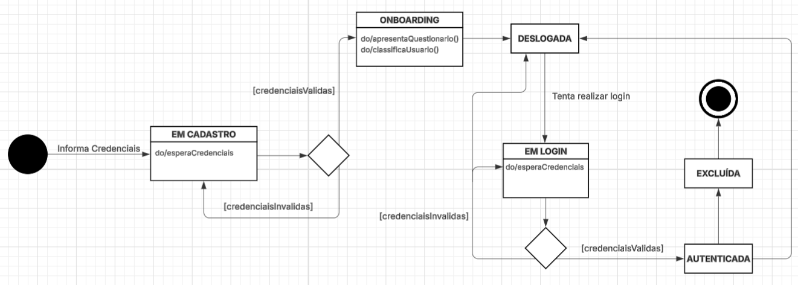

# 2.2. Modelagem Dinâmica

## 1. Introdução
A modelagem dinâmica tem como objetivo descrever o comportamento interno do sistema e como suas entidades reagem a eventos ao longo do tempo. Para cumprir o escopo desta entrega, optou-se pela elaboração de um **Diagrama de Estados**, focando no ciclo de vida da entidade central de acesso: a **Conta de Usuário**.

## 2. Diagrama de Estados: Conta de Usuário
O diagrama a seguir ilustra o ciclo de vida da conta no sistema **G7_MonitoreSeuTreino**, detalhando as transições desde a criação inicial no banco de dados até a exclusão permanente, passando pelas etapas de onboarding e autenticação.

*(Nota técnica: O arquivo da imagem está armazenado no diretório `/docs/anexos/` do repositório).*

## 3. Justificativas e Senso Crítico
A escolha de modelar a "Conta de Usuário" via Diagrama de Estados foi estratégica para validar a consistência arquitetural contra as Regras de Negócio (RN) e Requisitos Funcionais (RF) documentados:

* **Obrigatoriedade e Isolamento do Onboarding:** Após a criação da conta, a realização do questionário de onboarding se torna obrigatória. Em `EM CADASTRO` $\rightarrow$ `ONBOARDING` antes de liberar o status de `DESLOGADA/ATIVA`, o diagrama amarra visualmente a exigência dos requisitos RF08 e RF09 (Classificação de Perfil).
* **Segurança na Exclusão (RN12):** O diagrama permite que a transição para o estado `EXCLUÍDA` saia **apenas** do estado `AUTENTICADA`. Isso modela a regra lógica de que o sistema exige um token de sessão válido (verificação de identidade) antes de disparar a remoção definitiva dos dados pessoais.

## 7. Histórico de Versões

| Data       | Versão | Descrição                                      | Autor(es)       |
| ---------- | ------ | ---------------------------------------------- | --------------- |
| 23/04/2026 | 0.1    | Adição do Diagrama de Estados da Conta de Usuário e justificativas arquiteturais | José Victor Gabriel Menezes da Costa