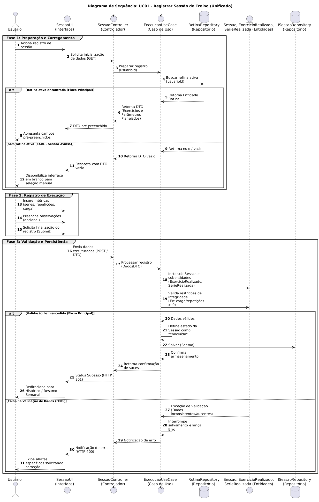
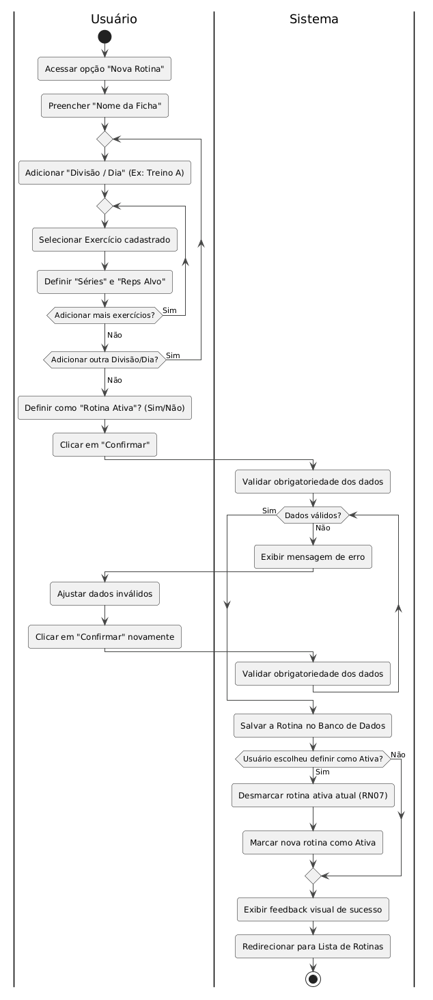
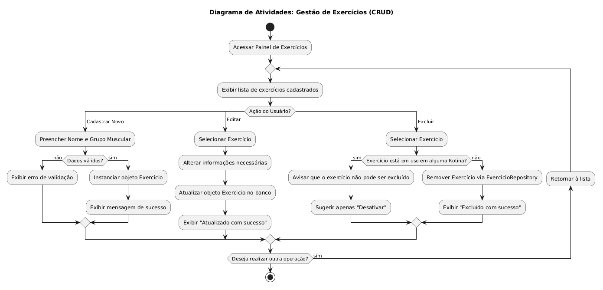
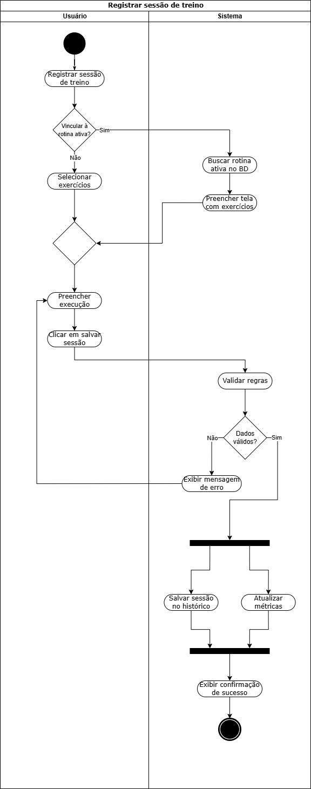

# 2.2. Modelagem Dinâmica

## 1. Metodologia

A modelagem dinâmica tem como objetivo descrever o comportamento interno do sistema e como suas entidades reagem a eventos ao longo do tempo. A construção foi realizada de forma colaborativa pela equipe, focando na representação temporal das trocas de mensagens entre os componentes do sistema e nos fluxos de controle de casos de uso prioritários.

Para cumprir o escopo desta entrega, optou-se pela elaboração de três artefatos complementares da UML:

- **Diagrama de Sequência**: adequado para ilustrar o fluxo de controle em arquiteturas baseadas em camadas, evidenciando as responsabilidades de cada componente durante a execução de um caso de uso específico.
- **Diagrama de Atividades**: representa o fluxo de ações de um processo, evidenciando sequência, decisões, paralelismo e responsabilidades entre atores e sistema.
- **Diagrama de Estados**: foca no ciclo de vida de uma entidade, descrevendo as transições entre seus estados ao longo do tempo.

## 2. Diagrama de Sequência: UC01 - Registrar Sessão de Treino

### 2.1. Objetivo

Este documento descreve as interações dinâmicas e o fluxo de mensagens entre o usuário, a interface e os componentes internos da arquitetura (Controladores, Casos de Uso, Entidades e Repositórios) durante o processo de registro de uma sessão de treino no sistema.

### 2.2. Atores e Componentes (Linhas de Vida)

O diagrama mapeia as seguintes linhas de vida, respeitando as fronteiras da Arquitetura Limpa:

- **Ator Principal:**
  - `Usuário` (User): O praticante que está registrando o treino.
- **Fronteira (Boundary / UI):**
  - `SessaoUI`: A interface gráfica com a qual o usuário interage.
- **Controles (Control):**
  - `SessaoController`: Responsável por receber as requisições (HTTP GET/POST) da UI e orquestrar as chamadas para a camada de negócio.
  - `ExecucaoUseCase`: O caso de uso que contém as regras de negócio de como uma sessão de treino deve ser criada, validada e salva.
- **Entidades (Entity):**
  - `Sessao`, `ExercicioRealizado`, `SerieRealizada`: Objetos de domínio instanciados durante a execução do treino.
- **Repositórios (Database / Infraestrutura):**
  - `IRotinaRepository`: Interface de acesso aos dados de rotinas de treino.
  - `ISessaoRepository`: Interface de acesso responsável por persistir os dados do registro da sessão.

---

### 2.3. Descrição do Fluxo de Eventos

O diagrama está estruturado em três fases principais de execução:

#### 2.3.1. Fase 1: Preparação e Carregamento

1. O `Usuário` acessa a interface (`SessaoUI`) acionando a opção de registrar uma nova sessão.
2. A interface solicita os dados iniciais via método GET ao `SessaoController`.
3. O controlador repassa a solicitação ao `ExecucaoUseCase` passando o ID do usuário (`usuarioId`).
4. O `ExecucaoUseCase` busca no repositório `IRotinaRepository` se existe alguma rotina ativa vinculada àquele usuário.
   - **Fluxo Principal (Rotina Ativa Encontrada):** O repositório retorna a entidade da rotina. O caso de uso mapeia esses dados em um DTO (_Data Transfer Object_) contendo os exercícios e parâmetros planejados, e envia para o controlador. O controlador repassa à interface, que apresenta os campos **pré-preenchidos** para o usuário.
   - **Fluxo Alternativo (FA01 - Sessão Avulsa):** Caso não seja encontrada nenhuma rotina ativa, o repositório retorna nulo/vazio. O caso de uso constrói um DTO vazio, e a interface disponibiliza um formulário em branco para que o usuário faça a **seleção manual** dos exercícios.

#### 2.3.2. Fase 2: Registro de Execução

5. O `Usuário` interage com a interface (`SessaoUI`) e insere suas métricas reais do treino, informando as séries, as repetições realizadas e a carga utilizada.
6. O `Usuário` preenche o campo de observações (ação opcional).
7. O `Usuário` clica no botão para finalizar o registro (ação de _Submit_).

#### 2.3.3. Fase 3: Validação e Persistência

8. A `SessaoUI` reúne os dados informados, empacota em um DTO estruturado e os envia via requisição POST ao `SessaoController`.
9. O controlador chama o método de processar registro do `ExecucaoUseCase` passando os dados.
10. O `ExecucaoUseCase` mapeia o DTO e instancia as entidades puras de domínio (`Sessao`, `ExercicioRealizado` e `SerieRealizada`).
11. Em seguida, o caso de uso aplica validações de regras de negócio em cima das entidades instanciadas (Exemplo: verifica se a carga e o número de repetições são maiores que zero).
    - **Fluxo Principal (Validação bem-sucedida):** As entidades confirmam que os dados são válidos. O `ExecucaoUseCase` define o estado interno da `Sessao` como “concluída” e aciona o `ISessaoRepository` para salvar as informações no banco de dados. Após a confirmação de persistência, o controlador devolve um status de sucesso (Ex: HTTP 201 Created), e a interface **redireciona** o usuário para a tela de Histórico ou Resumo Semanal.
    - **Fluxo de Exceção (FE01 - Falha na Validação):** As entidades indicam inconsistência nos dados (ex: campos faltando ou negativos) e lançam uma exceção de validação. O `ExecucaoUseCase` interrompe o processo de salvamento imediatamente e propaga o erro. O controlador retorna uma notificação de erro (Ex: HTTP 400 Bad Request) para a `SessaoUI`, que exibe alertas visuais específicos na tela orientando o usuário a corrigir as métricas antes de tentar novamente.

## 3. Diagrama de Atividades

Um **Diagrama de Atividades** é um artefato da UML que representa o fluxo de ações de um processo, evidenciando sequência, decisões, paralelismo e responsabilidades entre atores e sistema.

### 3.1. Criação de Rotina Semanal

#### 3.1.1. Objetivo
Este diagrama de atividades ilustra o fluxo comportamental do usuário ao criar uma nova rotina semanal no sistema, destacando os loops de repetição para inserção de exercícios, as validações de dados e o cumprimento da regra de negócio de unicidade de rotina ativa (RN07).

#### 3.1.2. Diagrama

#### 3.1.3. Descrição do Fluxo
O fluxo é dividido em duas raias (swimlanes): **Usuário** e **Sistema**.
1. O **Usuário** inicia o processo acessando a opção de nova rotina e preenchendo o nome da ficha.
2. O usuário entra em um loop onde adiciona as divisões (ex: Treino A, Treino B) e seleciona os exercícios com seus parâmetros (séries e repetições alvo).
3. Após finalizar a inclusão dos exercícios, o usuário decide se deseja marcar a rotina como "Ativa" e clica em Confirmar.
4. O **Sistema** assume o controle e realiza a validação de obrigatoriedade dos dados.
5. Se os dados forem inválidos, o sistema exibe um erro e devolve o controle ao usuário para ajustes, criando um laço de validação até que as informações estejam corretas.
6. Com os dados válidos, o sistema salva a rotina no banco de dados. Caso a opção de rotina ativa tenha sido selecionada, o sistema desmarca a rotina atual (respeitando a RN07) e ativa a nova.
7. Por fim, o sistema exibe o feedback visual de sucesso e redireciona o usuário para a lista de rotinas.

### 3.2. Gestão de Exercícios (CRUD)

#### 3.2.1. Objetivo
Modelar o comportamento dinâmico das operações de manutenção do catálogo de exercícios (CRUD). O foco principal é garantir que as alterações no catálogo sigam as regras de negócio de integridade, impedindo que a remoção de um dado afete negativamente planos de treino já estruturados por outros usuários.

#### 3.2.2. Diagrama

#### 3.2.3. Descrição do Fluxo

O fluxo inicia-se com o acesso ao Painel de Exercícios, disparando a exibição da lista de registros cadastrados. O usuário pode optar por três fluxos de modificação:

- **Cadastrar Novo:** O usuário preenche o nome e grupo muscular. O sistema valida os dados; se corretos, instancia o objeto Exercicio e exibe mensagem de sucesso. Caso contrário, retorna erro de validação.

- **Editar:** Permite a seleção de um exercício existente para alteração de informações. Após a edição, o sistema atualiza o objeto no banco de dados e confirma a operação.

- **Excluir (Remoção Condicional):** Ao tentar excluir, o sistema realiza uma verificação crítica: "O exercício está em uso em alguma Rotina?".
    - **Sim:** O sistema bloqueia a exclusão para evitar erros de referência e sugere apenas a desativação.
    - **Não:** O sistema permite a remoção física via ExercicioRepository e confirma o sucesso da exclusão.

### 3.3. Registrar Sessão de Treino

#### 3.3.1. Objetivo
O objetivo deste diagrama de atividades é representar visualmente o fluxo de controle e as interações necessárias para o registro de uma sessão de treino no sistema. Ele detalha o passo a passo das ações do usuário e o processamento em back-end do sistema, destacando os pontos de decisão (validação de regras de negócio) e o paralelismo nas operações de atualização de dados.

#### 3.3.2. Diagrama

*Figura 4 — Diagrama de Atividades: Registrar Sessão de Treino.*  
*Fonte: Elaborado por Daniel Teles*

#### 3.3.3. Descrição do Fluxo
O processo está dividido em duas raias de responsabilidade: **Usuário** e **Sistema**.

- **Início e Configuração:** O fluxo começa quando o usuário opta por registrar uma nova sessão. A primeira decisão é estrutural: vincular ou não a sessão a uma rotina ativa. Se o usuário escolher vincular, o sistema busca os dados no banco e pré-preenche a tela com os exercícios planejados; caso contrário, o usuário faz a seleção dos exercícios de forma manual.

- **Preenchimento e Submissão:** Após a definição da lista de exercícios (os caminhos convergem), o usuário preenche os dados da execução real (como carga e repetições) e clica no botão de salvar.

- **Validação (Loop de Correção):** O sistema assume o controle para validar as entradas com base nas regras de negócio. Se os dados forem inválidos, uma mensagem de erro é exibida e o fluxo retorna diretamente para a etapa de preenchimento, obrigando o usuário a corrigir as informações antes de prosseguir.

- **Paralelismo e Fim:** Com os dados validados, o fluxo atinge uma barra de sincronização (Fork), dividindo-se em duas ações simultâneas processadas pelo sistema: salvar a sessão no histórico de treinos e atualizar as métricas do resumo semanal. Após a conclusão de ambas as tarefas (Join), o sistema exibe uma mensagem de confirmação de sucesso para o usuário, encerrando o processo.

## 4. Diagrama de Estados: Conta de Usuário

### 4.1. Objetivo
O diagrama a seguir ilustra o ciclo de vida da conta no sistema **G7_MonitoreSeuTreino**, detalhando as transições desde a criação inicial no banco de dados até a exclusão permanente, passando pelas etapas de onboarding e autenticação.

### 4.2. Diagrama

*(Nota técnica: O arquivo da imagem está armazenado no diretório `/docs/anexos/` do repositório).*

### 4.3. Justificativas Arquiteturais
A escolha de modelar a "Conta de Usuário" via Diagrama de Estados foi estratégica para validar a consistência arquitetural contra as Regras de Negócio (RN) e Requisitos Funcionais (RF) documentados:

* **Obrigatoriedade e Isolamento do Onboarding:** Após a criação da conta, a realização do questionário de onboarding se torna obrigatória. Em `EM CADASTRO` $\rightarrow$ `ONBOARDING` antes de liberar o status de `DESLOGADA/ATIVA`, o diagrama amarra visualmente a exigência dos requisitos RF08 e RF09 (Classificação de Perfil).
* **Segurança na Exclusão (RN12):** O diagrama permite que a transição para o estado `EXCLUÍDA` saia **apenas** do estado `AUTENTICADA`. Isso modela a regra lógica de que o sistema exige um token de sessão válido (verificação de identidade) antes de disparar a remoção definitiva dos dados pessoais.

## 5. Diagrama de Estados: Exercício

### 5.1. Objetivo
O diagrama a seguir ilustra o ciclo de vida de um exercício no sistema **G7_MonitoreSeuTreino**, detalhando as transições desde o cadastro inicial pelo usuário até a exclusão, passando pela edição dos dados.

### 5.2. Diagrama

### 5.3. Descrição do Fluxo
A entidade **Exercício** foi modelada com foco nas ações disponíveis na interface — cadastrar, editar e excluir — refletindo diretamente o fluxo real do protótipo. Os guards `[dadosValidos]` e `[dadosInvalidos]` garantem consistência antes de qualquer persistência no banco, assegurando que somente dados íntegros transitem entre os estados do ciclo de vida.

## 6. Rastreabilidade e Elos com Outros Artefatos

O **Diagrama de Sequência** interliga diversos modelos concebidos anteriormente no projeto:

- **Modelagem Estática:** As linhas de vida instanciadas (`Sessao`, `ExercicioRealizado`, `ISessaoRepository`) possuem mapeamento direto um-para-um com as classes e interfaces definidas no **Diagrama de Classes** da modelagem estática.
- **Modelagem Organizacional:** O fluxo ilustra o passo a passo da realização do **Diagrama de Casos de Uso (UC01 - Registrar Sessão de Treino)**.
- **Protótipo:** As fases de interação do ator com a fronteira (`SessaoUI`) validam a navegação estipulada nas telas de acompanhamento de treino do protótipo de alta fidelidade.

Os **Diagramas de Atividades** também estabelecem elos diretos com outros artefatos do projeto:

- **Casos de Uso (Modelagem Organizacional):** Cada atividade detalha, em nível operacional, os cenários dos casos de uso priorizados (criação de rotina, gestão de exercícios e registro de sessão), evidenciando caminhos principais, alternativos e de exceção.
- **Modelagem Estática e Implementação:** As ações sistêmicas dos fluxos (salvar, validar, atualizar métricas, consultar repositórios) orientam a responsabilidade de classes, casos de uso e serviços definidos na arquitetura, fortalecendo a coerência entre análise e código.

O **Diagrama de Estados** complementa os demais artefatos ao descrever o ciclo de vida das entidades Conta de Usuário e Exercício, reforçando a coerência com o Diagrama de Classes e com as regras de negócio de integridade já tratadas no Diagrama de Atividades de Gestão de Exercícios (CRUD).

## 7. Análise Crítica (Senso Crítico)

A modelagem dinâmica do registro de treino evidenciou a importância de aplicar a inversão de dependência em tempo de execução. Ao utilizar abstrações (`IRotinaRepository` e `ISessaoRepository`) no diagrama de sequência, fica comprovado que o `ExecucaoUseCase` não depende de implementações concretas de infraestrutura.

Identificou-se também que delegar a responsabilidade de validação final para as Entidades (Fase 3, passo 11) impede que dados inconsistentes cheguem ao repositório, garantindo a integridade do domínio. O uso dos blocos `alt` no PlantUML provou-se fundamental para mapear as variações de percurso (como a ausência de rotina ativa - FA01), garantindo que a equipe de desenvolvimento tenha clareza sobre o comportamento esperado da API em cenários de erro.

Sob a ótica dos **Diagramas de Atividades**, a modelagem trouxe ganhos importantes de clareza de processo: os fluxos de criação de rotina, gestão de exercícios e registro de sessão deixaram explícitos os pontos de decisão, os laços de correção e o paralelismo entre operações do sistema. Isso reduz ambiguidades de implementação e facilita o alinhamento entre front-end, back-end e validações de negócio. Em especial, a presença de raias e nós de decisão melhora a rastreabilidade entre ação do usuário e resposta do sistema, apoiando discussões de priorização e refinamento durante o desenvolvimento.

Já os **Diagramas de Estados** destacaram a simplicidade necessária para o ciclo de vida dessas entidades, refletindo diretamente as ações disponíveis na interface. O uso de guards (`[dadosValidos]` e `[dadosInvalidos]`) deixou explícitas as pré-condições para cada transição, reforçando a consistência dos dados antes da persistência. Na Conta de Usuário, a modelagem validou a obrigatoriedade do onboarding (RF08/RF09) e a exigência de autenticação para exclusão (RN12); no Exercício, reforçou o fluxo real do protótipo com foco em cadastro, edição e exclusão.

Como ponto de melhoria para o projeto, os diagramas podem evoluir com maior detalhamento de cenários excepcionais (ex.: falha de persistência, indisponibilidade de serviço e conflitos de concorrência), incluindo políticas de recuperação e mensagens de retorno padronizadas. Essa evolução fortaleceria a preparação da equipe para testes de integração e testes de aceitação, além de reduzir risco de retrabalho em etapas futuras, sobretudo nos fluxos críticos de registro de sessão e atualização de métricas semanais.

## 8. Referências

1. SERRANO, Milene. **Arquitetura e Desenho de Software - Aula Modelagem UML Dinâmica**.
2. G7_MonitoreSeuTreino. **Documentação de Diagrama de Classes e Casos de Uso**.

## Histórico de Versão

|  **Data**  | **Versão** | **Descrição**                                                                    |            **Autor**                 | **Revisor** |
| :--------: | :--------: | :------------------------------------------------------------------------------- | :----------------------------------: | :---------: |
| 21/04/2026 |    1.0     | Elaboração do script PlantUML e fluxos descritivos.                              | Samuel Caetano                       |      -      |
| 21/04/2026 |    1.1     | Adição das seções 1 a 5                                                          | Samuel Caetano                       |      -      |
| 23/04/2026 |    1.2     | Inclusão do Diagrama de Atividades de Criação de Rotina Semanal e fluxos.        | Eduardo Waski                        |      -      |
| 23/04/2026 |    1.3     | Inclusão do Diagrama de Atividades de Gestão de Exercícios (CRUD)                | Giovanni Dornelas                    |      -      |
| 23/04/2026 |    1.4     | Inclusão do Diagrama de Atividades para o registro de sessão de treino           | Daniel Teles                         |      -      |
| 23/04/2026 |    1.5     | Adição do Diagrama de Estados do Exercício                                       | André Meyer                          |      -      |
| 23/04/2026 |    1.6     | Adição do Diagrama de Estados da Conta de Usuário e justificativas arquiteturais | José Victor Gabriel Menezes da Costa |      -      |
| 23/04/2026 |    1.7     | Adição do Diagrama de Estados do Exercício                                       | André Ricardo Meyer de Melo          |      -      |
| 23/04/2026 |    1.8     | Correção do conflito de merge                                                    | Lucas Antunes                        |      -      |
