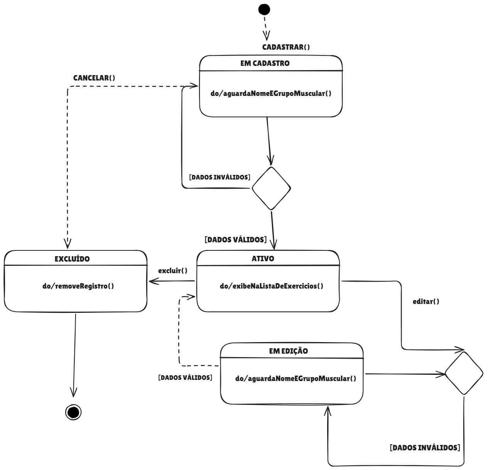

# 2.2. Modelagem Dinâmica

## 1. Introdução

A modelagem dinâmica tem como objetivo descrever o comportamento interno do sistema e como suas entidades reagem a eventos ao longo do tempo. Para cumprir o escopo desta entrega, optou-se pela elaboração de um **Diagrama de Estados**, focando no ciclo de vida da entidade **Exercícios**.

## 2. Diagrama de Estados: Exercício
O diagrama a seguir ilustra o ciclo de vida de um exercício no sistema **G7_MonitoreSeuTreino**, detalhando as transições desde o cadastro inicial pelo usuário até a exclusão, passando pela edição dos dados.

*(Nota técnica: O arquivo da imagem está armazenado no diretório `/docs/anexos/` do repositório).*

## 3. Justificativas e Senso Crítico

* **Simplicidade do Exercício:** A entidade Exercício foi modelada com foco nas ações disponíveis na interface — cadastrar, editar e excluir — refletindo diretamente o fluxo real do protótipo. Os guards `[dadosValidos]` e `[dadosInvalidos]` garantem consistência antes de qualquer persistência no banco.

## 7. Histórico de Versões

| Data       | Versão | Descrição                                      | Autor(es)       |
| ---------- | ------ | ---------------------------------------------- | --------------- |
| 23/04/2026 | 0.1    | Adição do Diagrama de Estados do Exercício | André Ricardo Meyer de Melo |
