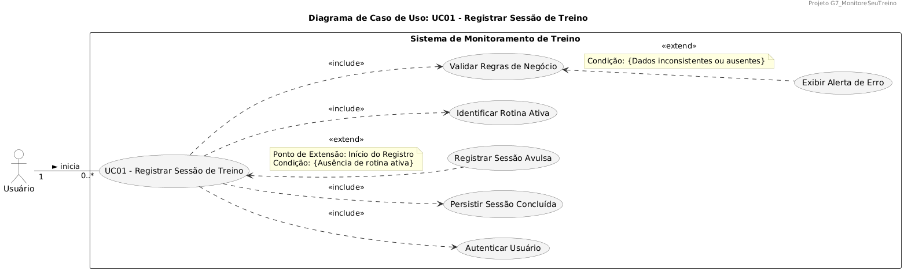
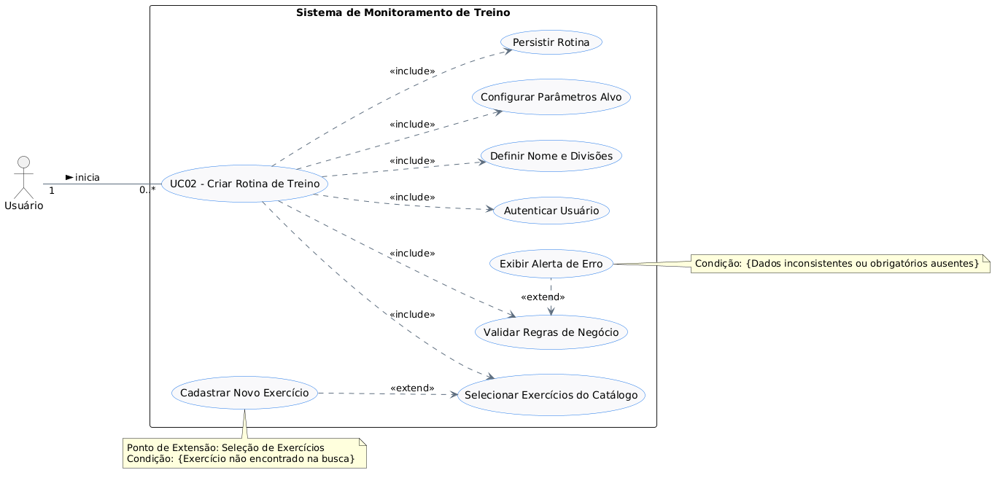

# 2.3. Modelagem Organizacional: Casos de Uso

## 1. Metodologia

Optou-se pelo **Diagrama de Casos de Uso** para mapear os requisitos funcionais de forma clara e orientada ao valor entregue ao usuário, servindo como uma ponte de comunicação entre a visão de negócios (Backlog do Produto) e a modelagem técnica (estática e dinâmica). O levantamento dos fluxos foi realizado com base nas _User Stories_ validadas na entrega anterior.

Os artefatos visuais e suas especificações foram estruturados utilizando a ferramenta **PlantUML**, garantindo padronização, rigor sintático e rastreabilidade via versionamento de código no repositório.

## 2. Diagrama de Caso de Uso: UC01 - Registrar Sessão de Treino

**Figura 1: Diagrama de Caso de Uso - UC01 (Registrar Sessão de Treino). Autor: Samuel Nogueira Caetano.**

### 2.1. Breve Descrição

Este caso de uso descreve os passos para que um usuário registre os dados e métricas de uma sessão de treinamento realizada no **Sistema de Monitoramento de Treino**. O processo abrange desde a identificação da rotina ativa até a validação das regras de negócio e a persistência dos dados.

### 2.2. Atores

- **Ator Principal:** `Usuário` (Um praticante que interage com o sistema para registrar seus treinos).
- **Ator Secundário:** `Sistema / Banco de Dados` (Responsável por autenticar, validar e persistir as informações).
- **Multiplicidade:** 1 Usuário pode iniciar de 0 a múltiplas instâncias deste caso de uso (`1 -- 0..*`).

### 2.3. Relacionamentos (Includes e Extends)

O diagrama mapeia módulos reutilizáveis e fluxos alternativos/exceções através de relacionamentos de inclusão e extensão:

- **Inclusões (`<<include>>`):** Etapas obrigatórias que sempre ocorrem durante o fluxo base.
  - **Autenticar Usuário:** O sistema deve garantir que o usuário está autenticado antes de prosseguir.
  - **Identificar Rotina Ativa:** O sistema verifica qual a rotina de treinos atual do usuário.
  - **Validar Regras de Negócio:** O sistema obrigatoriamente checa as métricas e dados inseridos.
  - **Persistir Sessão Concluída:** O sistema salva os dados no banco de dados ao final do processo.
- **Extensões (`<<extend>>`):** Etapas opcionais ou de desvio que ocorrem apenas sob condições específicas.
  - **Registrar Sessão Avulsa:** Estende o UC01.
    - _Ponto de Extensão:_ Início do Registro.
    - _Condição:_ Ausência de rotina ativa para o usuário.
  - **Exibir Alerta de Erro:** Estende o caso de uso incluído “Validar Regras de Negócio”.
    - _Condição:_ O sistema identifica dados inconsistentes ou ausentes durante a validação.

### 2.4. Fluxo de Eventos (UC01)

#### 2.4.1. Fluxo Principal

1. O `Usuário` solicita o registro de uma nova sessão de treino.
2. O sistema executa o caso de uso `Autenticar Usuário` (`<<include>>`).
3. O sistema executa o caso de uso `Identificar Rotina Ativa` (`<<include>>`), carregando os exercícios planejados.
4. O usuário insere as métricas de execução (ex: carga, séries, repetições) e submete o formulário.
5. O sistema executa o caso de uso `Validar Regras de Negócio` (`<<include>>`) para atestar a consistência das informações.
6. Com os dados válidos, o sistema executa o caso de uso `Persistir Sessão Concluída` (`<<include>>`).
7. O sistema informa ao usuário que a sessão foi registrada com sucesso e encerra o caso de uso.

#### 2.4.2. Fluxos Alternativos e de Exceção

- **FA01 - Registrar Sessão Avulsa (`<<extend>>`):** No passo 3, se o sistema identificar a ausência de rotina ativa, o fluxo é desviado. O sistema disponibiliza uma interface limpa onde o usuário seleciona manualmente os exercícios e preenche as métricas. O fluxo retorna ao passo 5.
- **FE01 - Exibir Alerta de Erro (`<<extend>>`):** No passo 5, se o sistema detectar dados inconsistentes (ex: valores negativos ou campos vazios), interrompe o salvamento, exibe um alerta de erro e solicita correção (retorna ao passo 4).

## 3. Diagrama de Caso de Uso: UC02 - Criar Rotina de Treino

**Figura 2: Diagrama de Caso de Uso - UC02 (Criar Rotina de Treino). Autor: Eduardo Waski.**

### 3.1. Breve Descrição

Descreve de forma granular os passos para que um usuário crie uma nova ficha de treino semanal (Rotina) no sistema. O fluxo abrange a definição da estrutura de divisões (ex: Treino A, Treino B), a busca de movimentos no catálogo e a definição das metas de execução (séries e repetições alvo).

### 3.2. Atores

- **Ator Principal:** `Usuário` (Praticante que planeja seus treinos na plataforma).
- **Ator Secundário:** `Sistema / Banco de Dados` (Responsável por autenticar o usuário, buscar o catálogo de exercícios e persistir a nova rotina).
- **Multiplicidade:** 1 Usuário pode iniciar de 0 a múltiplas instâncias deste caso de uso (`1 -- 0..*`).

### 3.3. Relacionamentos (Includes e Extends)

- **Inclusões (`<<include>>`):** Etapas obrigatórias que compõem o fluxo de criação.
  - **Autenticar Usuário:** O sistema verifica se o usuário possui uma sessão de login ativa.
  - **Definir Nome e Divisões:** Passo onde a estrutura base da ficha é criada (ex: “Treino de Força”, dividido em dias da semana).
  - **Selecionar Exercícios do Catálogo:** Ação de buscar e inserir os movimentos em cada divisão criada.
  - **Configurar Parâmetros Alvo:** Definição obrigatória das metas de execução para cada exercício (ex: 4 séries, 8-12 repetições).
  - **Validar Regras de Negócio:** O sistema checa se a rotina possui pelo menos um exercício e se os alvos são valores válidos.
  - **Persistir Rotina:** O sistema salva a estrutura montada no banco de dados.
- **Extensões (`<<extend>>`):** Etapas acionadas apenas sob condições específicas.
  - **Cadastrar Novo Exercício:** Estende a etapa de “Selecionar Exercícios do Catálogo”.
    - _Condição:_ O usuário busca por um exercício específico e o sistema não o encontra, permitindo a criação do exercício sem perder o progresso da montagem da rotina.
  - **Exibir Alerta de Erro:** Estende a etapa de validação.
    - _Condição:_ O usuário tenta salvar a rotina com campos obrigatórios em branco ou valores incorretos.

### 3.4. Fluxo de Eventos (UC02)

#### 3.4.1. Fluxo Principal

1. O `Usuário` solicita a criação de uma “Nova Rotina” através da interface.
2. O sistema executa o `Autenticar Usuário` (`<<include>>`).
3. O sistema executa o `Definir Nome e Divisões` (`<<include>>`), solicitando que o usuário nomeie a ficha e adicione suas divisões.
4. Para cada divisão, o sistema aciona o `Selecionar Exercícios do Catálogo` (`<<include>>`), permitindo a busca textual.
5. Em seguida, o sistema aciona o `Configurar Parâmetros Alvo` (`<<include>>`), onde o usuário preenche a quantidade de séries e repetições estimadas para cada movimento.
6. O usuário submete o formulário para salvar a rotina.
7. O sistema executa o `Validar Regras de Negócio` (`<<include>>`) para garantir a integridade da estrutura.
8. Com os dados atestados, o sistema executa o `Persistir Rotina` (`<<include>>`).
9. O sistema exibe notificação visual de sucesso, redireciona o usuário para a tela de listagem de rotinas e encerra o caso de uso.

#### 3.4.2. Fluxos Alternativos e de Exceção

- **FA01 - Cadastrar Novo Exercício (`<<extend>>`):** No passo 4, se o usuário não encontrar o exercício desejado, clica em “Adicionar Novo Exercício”. O sistema abre um formulário modal, salva o novo exercício no banco e o injeta imediatamente à divisão. O fluxo retorna ao passo 5.
- **FE01 - Exibir Alerta de Erro (`<<extend>>`):** No passo 7, se a validação falhar (ex: criar uma divisão sem exercícios), o sistema interrompe a persistência e alerta o usuário destacando os erros. O usuário corrige e tenta salvar novamente (retorna ao passo 6).

## 4. Pré-condições e Pós-condições

### 4.1. Pré-condições

- O sistema deve estar operacional e acessível via interface.
- O usuário deve possuir um cadastro prévio válido e estar autenticado com sucesso pelo fluxo `UC_Autenticar`.
- O banco de dados deve possuir um catálogo de exercícios ativos carregado para viabilizar a seleção e montagem de rotinas.

### 4.2. Pós-condições

- **Cenário de Sucesso:** Novas entidades de `Sessao` ou `Rotina` (e suas respectivas subentidades atreladas) são instanciadas e persistidas com sucesso no banco de dados, tornando-se imediatamente visíveis nos históricos e dashboards do usuário.
- **Cenário de Falha:** Nenhuma alteração é feita no banco de dados. O estado anterior do sistema é rigorosamente mantido e a integridade dos dados é preservada, evitando registros corrompidos.

## 5. Rastreabilidade e Elos com Outros Artefatos

Os diagramas de Casos de Uso atuam como um elo integrador entre os requisitos em linguagem natural e a arquitetura técnica do sistema:

- **Backlog do Produto:** O **UC01** materializa diretamente a **US22** (Registrar sessão). O **UC02** materializa a **US17** (Criar rotina) e invoca a **US13** (Cadastrar exercício) por meio do fluxo alternativo de extensão.
- **Léxico:** Os termos técnicos adotados nos atores e nas etapas (como _Rotina_ L03, _Exercício_ L04, _Sessão_ L06 e _Parâmetros Planejados_ L05) estão ancorados rigorosamente na documentação do Léxico.
- **Protótipo:** Os fluxos descritos refletem fielmente a experiência de usuário desenhada nas telas de “Registro de Sessão” e “Cadastrar Ficha” do Protótipo de Alta Fidelidade.
- **Modelagem Dinâmica:** A especificação em passos deste documento dita exatamente a ordem temporal e as condições de troca de mensagens ilustradas no **Diagrama de Sequência**.

## 6. Análise Crítica (Senso Crítico)

### 6.1. Perspectiva do Autor sobre a Geração Automática

**Autor: Samuel Nogueira Caetano**

A decisão de construir os Diagramas de Casos de Uso através de ferramentas de codificação visual (PlantUML) não se resumiu a uma geração automática e passiva de gráficos. Ao adotar a abordagem de “Diagram as Code”, o esforço cognitivo foi inteiramente direcionado à modelagem lógica do sistema. A definição estrita das interações (`<<include>>` e `<<extend>>`) exigiu uma análise profunda das Regras de Negócio e das User Stories.

A ferramenta apenas renderizou as instruções fornecidas, mas o isolamento das etapas — como tratar a “Validação de Regras de Negócio” como um módulo obrigatório reutilizável, ou o “Registro de Sessão Avulsa” como um desvio comportamental controlado — foi um exercício ativo de engenharia de requisitos da minha parte, garantindo que o modelo organizacional fosse flexível, preciso e coerente com as necessidades dos usuários.

### 6.2. Análise Geral sobre a Modelagem

A utilização estruturada de relacionamentos `<<include>>` e `<<extend>>` provou-se altamente vantajosa para modularizar os requisitos do sistema. Isolar o passo de **“Validar Regras de Negócio”** como um `<<include>>`, por exemplo, garante que esta lógica seja enxergada como um componente reutilizável em múltiplos cenários do sistema.

Adicionalmente, tratar o registro sem rotina como um fluxo de extensão (FA01 - Sessão Avulsa) evitou o engessamento arquitetural do sistema. Em vez de obrigar todos os usuários a criarem uma rotina prévia rigorosa para usar o aplicativo, o fluxo abraça a flexibilidade.

Por fim, a decomposição do fluxo de **Criar Rotina (UC02)** em etapas menores aproxima fortemente a modelagem organizacional da usabilidade desenhada no Protótipo. A adição do ponto de extensão (`<<extend>>`) para o **Cadastro de Exercício** atrelado diretamente à “Seleção de Exercícios” reflete uma excelente decisão de UX. Isso impede a quebra de fluxo do usuário, permitindo que a criação do exercício seja injetada _on-the-fly_ (em tempo de execução), retendo o usuário e preservando a fluidez do processo de planejamento.

## 7. Referências

1. G7_MonitoreSeuTreino. **Documentação Base (Backlog, Léxico, Protótipo)**.
2. SERRANO, Milene. **Arquitetura e Desenho de Software - Aulas de Modelagem de Software**.

---

## Histórico de Versão

|  **Data**  | **Versão** | **Descrição**                                           |   **Autor**    |  **Revisor**  |
| :--------: | :--------: | :------------------------------------------------------ | :------------: | :-----------: |
| 21/04/2026 |    1.0     | Elaboração do script PlantUML e fluxos descritivos.     | Samuel Caetano | Eduardo Waski |
| 21/04/2026 |    1.1     | Adição das seções 1 a 7                                 | Samuel Caetano | Eduardo Waski |
| 23/04/2026 |    1.2     | Integração do UC02 de criação de rotina e revisão geral | Eduardo Waski  | Lucas Antunes |
| 24/04/2026 |    1.3     | Padronização de autoria nos diagramas e senso crítico.  | Samuel Caetano |       -       |
