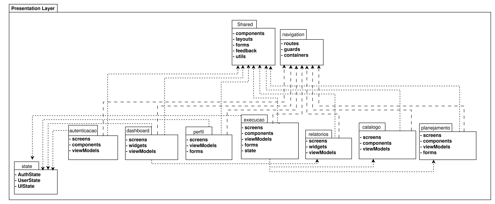
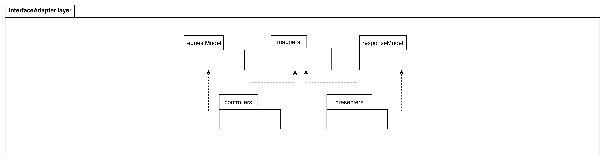
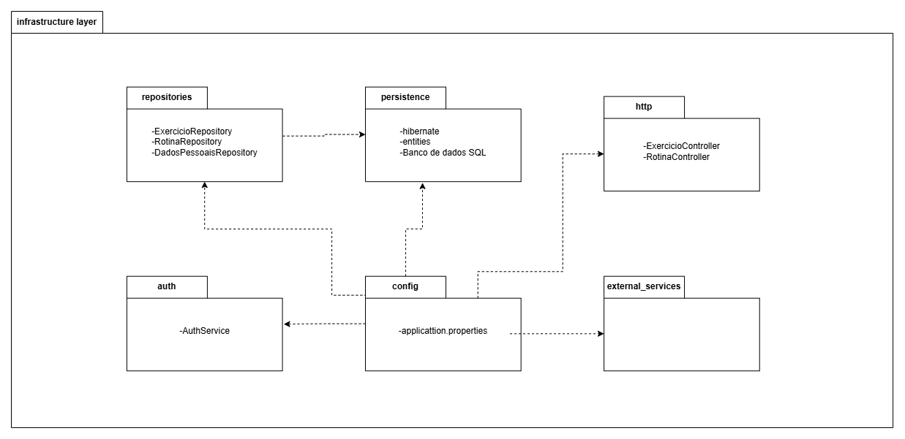
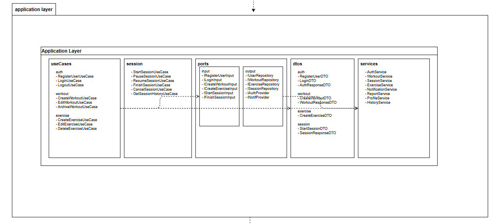

# 2.4. Modelagem Organizacional: Pastas

## 1. Metodologia

Optou-se pelo Diagrama de Pacotes para representar a estrutura modular do sistema em um nível de abstração mais alto do que o diagrama de classes, permitindo agrupar elementos semanticamente relacionados e explicitar dependências entre módulos.

Os artefatos visuais foram estruturados utilizando a ferramenta **DrawIO**, garantindo padronização, rastreabilidade via versionamento e, principalmente, um ambiente colaborativo.

## 2. Visão geral 

### 2.1 Objetivo

O foco desse diagrama é a representação do sistema em um nível mais alto de abstração, permitindo visualizar como as responsabilidades são distribuídas entre as camadas da aplicação e como cada pacote se relaciona com os demais. Em vez de listar classes individualmente, esse tipo de diagrama evidencia a divisão por contextos e fronteiras arquiteturais, o que facilita a compreensão do sistema como um todo.

No caso do projeto, mostra-se a separação entre Presentation Layer, InterfaceAdapter Layer, Infrastructure Layer, Application Layer e Domain Layer, refletindo uma organização alinhada a uma arquitetura em camadas e orientada à inversão de dependência. Assim, o foco deixa de ser somente a funcionalidade isolada e passa a ser a estrutura global do software, incluindo as responsabilidades da interface, da aplicação, da persistência e do núcleo de negócio.

### 2.2. Diagrama

### 2.2. Descrição

O diagrama completo mostra uma arquitetura organizada em cinco grandes blocos:

#### 2.2.1 Presentation Layer

É a camada mais externa voltada à interface com o usuário. Nela aparecem pacotes como autenticacao, dashboard, perfil, execucao, relatorios, catalogo e planejamento, além de pacotes compartilhados como shared, navigation e state.

Essa camada concentra as telas, componentes visuais, formulários, layouts, rotas, guards e estados da interface. Sua responsabilidade é apresentar informação, capturar interação e encaminhar ações para as camadas internas, sem conter regras centrais de negócio.

InterfaceAdapter Layer

Esta camada faz a mediação entre a interface e a aplicação. Os pacotes requestModel, mappers, responseModel, controllers e presenters indicam claramente a função de tradução entre os formatos usados pela interface e os formatos esperados pela camada de aplicação.

É aqui que os dados são adaptados, convertidos e preparados para circulação entre o mundo externo e os casos de uso. Isso é importante porque impede que a interface conheça detalhes internos da aplicação ou do domínio.

#### 2.2.2 Infrastructure Layer

A camada de infraestrutura reúne os aspectos técnicos e concretos do sistema: repositories, persistence, http, auth, config e external_services.

Essa camada concentra detalhes como acesso a banco, implementação de repositórios, configuração da aplicação, autenticação, comunicação HTTP e integração com serviços externos. Ela é deliberadamente periférica, pois serve de suporte às regras do sistema, não sendo o núcleo do negócio.

#### 2.2.3 Application Layer

A camada de aplicação organiza os casos de uso e suas dependências imediatas. No diagrama aparecem os pacotes useCases, session, ports, dtos e services.

Esse bloco é o responsável por orquestrar o comportamento do sistema. Ele recebe comandos da interface, aciona regras, coordena entidades e solicita persistência ou outros serviços por meio de portas. Em outras palavras, é a camada que transforma intenções do usuário em fluxos de execução concretos.

#### 2.2.4 Domain Layer

Na base do modelo está a Domain Layer, com os pacotes exercicios, usuario, rotina, sessao_treino e acompanhamento.

Esses pacotes representam o núcleo conceitual do sistema. Cada um está organizado com seus elementos centrais de negócio, como entidades, value objects e services. É também nessa camada que aparecem as dependências semânticas mais importantes do projeto: planejamento depende de exercícios e usuário; sessão depende de exercícios e pode depender de rotina de forma opcional; acompanhamento depende da sessão de treino.

#### 2.2.5 Estrutura interna geral

O modelo mostra ainda uma organização interna coerente em cada camada, com separação entre blocos de responsabilidade. Isso cria um mapa bem legível da arquitetura, evitando a mistura entre apresentação, aplicação, domínio e infraestrutura.

## 3. Presentation Layer

### 3.1. Objetivo

Este "subdiagrama" organiza a camada de apresentação do sistema, responsável pela interação direta com o usuário. A estrutura foi definida com base nos principais contextos funcionais da aplicação, refletindo as áreas visíveis da interface, como **autenticacao**, **dashboard**, **planejamento**, **catalogo**, **execucao**, **perfil** e **relatorios**, além de pacotes transversais como **shared**, **navigation** e **state**.

A escolha por essa organização segue uma abordagem modular orientada a funcionalidades, garantindo maior alinhamento com o domínio do sistema e facilitando a evolução da interface conforme novas features são adicionadas.

### 3.2. Diagrama

*Diagrama de Pacotes - Presentation Layer.*

### 3.3. Descrição

Na modelagem proposta, cada pacote funcional representa uma área específica da interface do usuário. O pacote **autenticacao** concentra as telas e fluxos relacionados ao acesso ao sistema, enquanto o **dashboard** apresenta uma visão geral consolidada das informações do usuário. O pacote **planejamento** trata da organização da rotina de treino, e **catalogo** permite a navegação e consulta dos exercícios disponíveis.

O pacote **execucao** representa a interação durante a realização da sessão de treino, sendo um dos fluxos mais dinâmicos da interface. Já o pacote **perfil** agrupa as informações e configurações do usuário, enquanto **relatorios** é responsável pela visualização de métricas, histórico e acompanhamento da evolução.

Além dos pacotes funcionais, existem estruturas transversais. O pacote **shared** reúne componentes reutilizáveis e elementos comuns da interface, como layouts e utilitários visuais. O pacote **navigation** centraliza o controle de rotas e fluxo de navegação entre telas, e o pacote **state** gerencia o estado da interface quando necessário.

As dependências entre os pacotes seguem o princípio de baixo acoplamento, com as funcionalidades dependendo principalmente de **shared**, **navigation** e, quando aplicável, de **state**, evitando dependências diretas entre módulos funcionais. Essa organização contribui para a escalabilidade e manutenção da camada de apresentação, mantendo-a desacoplada das regras de negócio e das demais camadas do sistema.

## 4. Interface Adapters Layer

### 4.1. Objetivo

Este "subdiagrama" organiza a camada de adaptadores de interface do sistema, responsável por intermediar a comunicação entre a **Presentation Layer** e a **Application Layer**. Sua função é traduzir os dados entre os formatos utilizados pela interface e aqueles esperados pelos casos de uso, garantindo o desacoplamento entre a interação com o usuário e a lógica de negócio.

A estrutura segue os mesmos contextos funcionais definidos na camada de apresentação, como **autenticacao**, **dashboard**, **planejamento**, **catalogo**, **execucao**, **perfil** e **relatorios**, além de um pacote **shared** para elementos comuns e um padrão estrutural interno reutilizado entre os módulos.

### 4.2. Diagrama

*Diagrama de Pacotes - Interface Adapters Layer.*

### 4.3. Descrição

Na modelagem proposta, cada pacote funcional da camada de adaptadores corresponde diretamente a um módulo da camada de apresentação, atuando como sua contraparte responsável pela mediação com a aplicação. O pacote **autenticacao**, por exemplo, recebe as ações da interface de login e as converte em chamadas para os casos de uso correspondentes. O mesmo padrão se repete para **dashboard**, **planejamento**, **catalogo**, **execucao**, **perfil** e **relatorios**.

Internamente, todos os pacotes seguem uma estrutura padronizada composta por **controllers**, **presenters**, **mappers**, **request models** e **response models**. Os **controllers** recebem as requisições da interface e acionam as portas de entrada da camada de aplicação. Os **presenters** são responsáveis por adaptar as respostas para um formato adequado à apresentação. Os **mappers** realizam a conversão entre os diferentes modelos de dados, enquanto **request models** e **response models** representam, respectivamente, as estruturas de entrada e saída dessa camada.

O pacote **shared** concentra elementos reutilizáveis da camada, como classes base, tratamento de erros e utilitários auxiliares, evitando duplicação de código entre os módulos funcionais.

As dependências internas seguem uma lógica clara: **controllers** dependem de **mappers** e **request models**, enquanto **presenters** dependem de **mappers** e **response models**. Em nível de camadas, a Interface Adapters depende da **Application Layer** por meio das portas de entrada (Input Ports), enquanto é acionada pela **Presentation Layer**, mantendo o fluxo unidirecional e respeitando a regra de dependência da arquitetura.

Essa organização garante que a interface e a lógica de negócio permaneçam desacopladas, permitindo a evolução independente das camadas e maior flexibilidade na adaptação de diferentes interfaces ou tecnologias de entrada.

## 5. Infrastructure Layer

### 5.1. Objetivo

Este "subdiagrama" organiza a camada de infraestrutura do sistema, o nível mais externo da Clean Architecture. Sua função é abrigar todos os detalhes técnicos, frameworks, configurações de banco de dados, entrega web e serviços de terceiros.

O objetivo dessa modelagem é demonstrar que as tecnologias (como o banco de dados SQL, ORMs ou bibliotecas de roteamento) estão isoladas em seus próprios módulos. Essa separação garante que o núcleo do sistema (Application e Domain) não seja contaminado por detalhes de infraestrutura, permitindo que essas tecnologias sejam substituídas ou atualizadas no futuro com o mínimo de impacto nas regras de negócio.

### 5.2. Diagrama

*Diagrama de Pacotes - Infrastructure Layer. Autor: [Daniel Teles](https://github.com/dtdanielteles)*

### 5.3. Descrição

Na modelagem proposta, a camada de infraestrutura é dividida em módulos técnicos com responsabilidades específicas e isoladas.

O pacote **persistence** encapsula a comunicação com o banco de dados, abrigando as configurações do SGBD (Banco de dados SQL) e as ferramentas de mapeamento objeto-relacional (ORM), como o Hibernate e a definição das entidades de banco. Imediatamente ao lado, o pacote **repositories** contém as implementações concretas dos contratos de acesso a dados, contendo classes como **ExercicioRepository**, **RotinaRepository** e **DadosPessoaisRepository**. O diagrama mostra explicitamente que **repositories** depende de **persistence** para executar as operações de leitura e escrita.

O pacote **http** é responsável pela exposição da aplicação para o mundo externo, lidando com requisições web e roteamento, abrigando implementações técnicas como **ExercicioController** e **RotinaController**. O pacote **auth** contém a implementação real dos mecanismos de segurança do sistema (AuthService), como geração de tokens e criptografia, enquanto o pacote **external_services** reserva o espaço estrutural para futuras integrações com APIs de terceiros.

O grande destaque estrutural deste diagrama é o pacote **config**. Ele atua como o ponto de composição do sistema (Container de Injeção de Dependências) e armazena os arquivos de configuração (**application.properties**). É possível notar que o config possui dependências (setas) apontando para todos os demais pacotes da infraestrutura (**repositories**, **persistence**, **auth**, **http**, **external_services**). Isso reflete fielmente o seu papel: é ele quem conhece todas as peças técnicas concretas para instanciá-las e injetá-las nas portas da Application Layer no momento em que a aplicação é iniciada.

## 6. Application Layer

### 6.1. Objetivo

Este "subdiagrama" organiza a camada de aplicação do sistema, 
responsável por orquestrar os fluxos de negócio na Clean Architecture. 
Sua função é abrigar os casos de uso do sistema, as interfaces de 
comunicação com as camadas adjacentes e os objetos de transferência 
de dados.

O objetivo dessa modelagem é demonstrar que a Application Layer atua 
como o maestro do sistema: ela conhece O QUE deve ser feito, mas não 
COMO — delegando os detalhes técnicos para a Infrastructure Layer e 
os detalhes de apresentação para a Presentation Layer. Essa separação 
garante que as regras de negócio permaneçam isoladas de frameworks, 
banco de dados e interfaces, tornando o sistema mais testável e 
sustentável a longo prazo.

### 6.2. Diagrama

*Diagrama de Pacotes - Application Layer. Autor: [Andre Meyer](https://github.com/Andremeyerr)*

### 6.3. Descrição

Na modelagem proposta, a camada de aplicação é dividida em quatro 
pacotes com responsabilidades bem definidas.

O pacote **useCases** é o núcleo desta camada e concentra toda a 
lógica de orquestração do sistema, organizado em submódulos por 
domínio: **auth** (RegisterUserUseCase, LoginUseCase, LogoutUseCase), 
**workout** (CreateWorkoutUseCase, EditWorkoutUseCase, 
ArchiveWorkoutUseCase), **exercise** (CreateExerciseUseCase, 
EditExerciseUseCase, DeleteExerciseUseCase) e **session** 
(StartSessionUseCase, PauseSessionUseCase, ResumeSessionUseCase, 
FinishSessionUseCase, CancelSessionUseCase, GetSessionHistoryUseCase). 
Cada caso de uso encapsula exatamente uma ação do sistema, seguindo o 
princípio da responsabilidade única.

O pacote **ports** define os contratos de comunicação da camada, 
subdividido em **input** e **output**. O subpacote **input** contém 
as interfaces que a camada superior (InterfaceAdapter) utiliza para 
acionar os casos de uso, como IRegisterUserInput, ILoginInput e 
ICreateWorkoutInput. O subpacote **output** contém as interfaces que 
a camada inferior (Infrastructure) deve implementar para fornecer 
acesso a dados e serviços externos, como IUserRepository, 
IWorkoutRepository, ISessionRepository, IAuthProvider e 
INotifProvider. Essa inversão de dependência é o mecanismo central 
que mantém o núcleo do sistema independente de tecnologias concretas.

O pacote **dtos** (Data Transfer Objects) define os objetos de entrada 
e saída de cada caso de uso, organizados por domínio: auth 
(RegisterUserDTO, LoginDTO, AuthResponseDTO), workout 
(CreateWorkoutDTO, WorkoutResponseDTO), exercise (CreateExerciseDTO, 
ExerciseResponseDTO) e session (StartSessionDTO, SessionResponseDTO). 
Esses objetos garantem que os dados trafeguem entre as camadas de 
forma estruturada e desacoplada das entidades de domínio.

Por fim, o pacote **services** agrupa serviços de suporte transversais 
aos casos de uso, como AuthService, WorkoutService, SessionService, 
ExerciseService, NotificationService, ReportService, ProfileService e 
HistoryService. Diferentemente dos casos de uso, os services 
encapsulam operações reutilizáveis que podem ser compartilhadas entre 
múltiplos fluxos do sistema.

## 7. Domain Layer

### 7.1. Objetivo

Este "subdiagrama" organiza o núcleo das regras de negócio do sistema em pacotes de domínio coerentes, representando os principais contextos funcionais da aplicação: **usuario**, **exercicios**, **rotina**, **sessao_treino** e **acompanhamento**. A escolha por essa separação está em linha com a visão do produto e com os requisitos do sistema, que destacam onboarding e perfil, planejamento da rotina semanal, catálogo de exercícios, registro da sessão e acompanhamento por histórico e resumo semanal.

### 7.2. Diagrama

*Diagrama de Pacotes - Domain Layer. Autor: [João Nascimento](https://github.com/JMPNascimento) e [José Victor](https://github.com/RR2M4A).*

### 7.3. Descrição

Na modelagem proposta, o pacote **usuario** concentra as entidades e objetos de valor responsáveis pela identidade do usuário e pela classificação obtida no onboarding. O pacote **exercicios** reúne o catálogo de exercícios, com suas características descritivas. O pacote **rotina** contém os elementos de planejamento semanal, enquanto **sessao_treino** representa a sessão de treino executada de fato. Por fim, **acompanhamento** consolida as informações derivadas da sessão de treino, especialmente o resumo semanal e a constância do usuário.

Em termos de organização interna, cada pacote pode ser detalhado em três grupos: **entities**, **value objects** e **services**. Essa divisão deixa claro o que é dado do domínio, o que é regra de negócio e o que é comportamento derivado.

A dependência entre os pacotes segue uma lógica de uso real do domínio: **rotina** depende de **exercicios** e de **usuario**, pois a montagem da ficha semanal considera o perfil e os exercícios cadastrados; **sessao_treino** depende de **exercicios** e pode depender de **rotina** de forma opcional, pois o sistema permite sessão avulsa; **acompanhamento** depende de **sessao_treino**, porque o resumo semanal é calculado a partir das sessões concluídas.

## 8. Rastreabilidade e Elos com Outros Artefatos

Esse diagrama conversa diretamente com os demais artefatos do projeto.

- Com a visão do produto:

A visão do produto define que o sistema deve permitir organizar treinos, registrar execuções, acompanhar constância semanal e apoiar o onboarding por perfil. Esses objetivos aparecem distribuídos pelos pacotes principais da arquitetura, principalmente na divisão entre usuario, rotina, sessao_treino e acompanhamento.

- Com o backlog:

O backlog organiza o sistema em épicos, features e user stories. Essa organização aparece refletida nos pacotes da Presentation Layer, onde cada área funcional foi separada em subpacotes como autenticacao, perfil, execucao, catalogo, planejamento e relatorios.

- Com o diagrama de classes:

O diagrama de classes sustenta a Domain Layer, porque é nele que aparecem as entidades e relacionamentos centrais do domínio. A arquitetura em pacotes apenas reorganiza essas classes em blocos conceituais mais amplos, facilitando a leitura do núcleo do negócio.

- Com o diagrama de componentes:

O diagrama de componentes ajuda a explicar como os subsistemas se conectam e quais serviços são expostos externamente. Já o diagrama de pacotes detalha como isso se distribui internamente em camadas e módulos. Os dois se complementam: um mostra a estrutura macro de comunicação; o outro mostra a organização interna.

- Com o diagrama de estados e os diagramas dinâmicos:

O pacote sessao_treino se relaciona diretamente ao diagrama de estados da sessão, porque é ali que está o comportamento temporal da execução do treino. Da mesma forma, os fluxos dinâmicos de criação de rotina, registro de sessão e geração de resumo ajudam a justificar a distribuição dos pacotes de aplicação e domínio.

- Com a arquitetura limpa:

A estrutura em camadas do diagrama está em sintonia com a separação entre interface, aplicação, domínio e infraestrutura. Isso reforça o princípio de que as dependências devem caminhar das bordas para o centro e que o núcleo de regras de negócio deve permanecer protegido das decisões técnicas de interface e persistência.

## 9. Análise Crítica (Senso Crítico)

A principal vantagem desse diagrama é a clareza arquitetural. Em vez de tratar o sistema como uma lista de classes soltas, o modelo organiza o domínio em contextos que fazem sentido para o negócio. Isso melhora a manutenção, reduz acoplamento semântico e facilita a comunicação com a equipe, porque cada pacote passa a representar uma responsabilidade compreensível. Outro ponto forte é a boa rastreabilidade entre os artefatos. O que está no backlog reaparece como pacotes funcionais; o que está no diagrama de classes reaparece como domínio; o que está na dinâmica aparece associado aos pacotes de aplicação e comportamento. Essa coerência reduz ruído e fortalece a consistência da documentação. Há, porém, um ponto de atenção: a camada de apresentação tende a crescer bastante, porque concentra várias áreas funcionais e ainda possui pacotes compartilhados como shared, navigation e state. Isso é aceitável, mas exige disciplina para não transformar o pacote compartilhado em um “depósito genérico” de tudo que não cabe em outro lugar.

## 10. Referências

1. G7_MonitoreSeuTreino. **Documentação Base (Backlog, Léxico, Protótipo)**.
2. SERRANO, Milene. **Arquitetura e Desenho de Software - Aulas de Modelagem de Software**.

---

## Histórico de Versão

|  **Data**  | **Versão** | **Descrição**                                                           |                                                 **Autor**                                                 |  **Revisor**  |
|:----------:|:----------:|:------------------------------------------------------------------------|:---------------------------------------------------------------------------------------------------------:|:-------------:|
| 24/04/2026 |    1.0     | Criação do diagrama de pacotes                                          | João Nascimento, Lucas Antunes, José Victor, André Meyer, Daniel Teles, Giovanni Dornelas, Mateus Negrini | Lucas Antunes |
| 24/04/2026 |    1.1     | Estruturação inicial da página, adição da Visão geral e da Domain Layer |                                       João Nascimento, José Victor                                        | Lucas Antunes |
| 24/04/2026 |    1.2     | Adição e detalhamento das camadas Presentation e Interface Adapters     |                                     Lucas Antunes e Giovanni Dornelas                                     |       -       |
| 24/04/2026 |    1.3     | Adição e detalhamento da camada Infrastructure     |           Daniel Teles            |       -       |
| 24/04/2026 |    1.4     | Adição e detalhamento da camada Application     |           Andre Meyer            |       -       |
