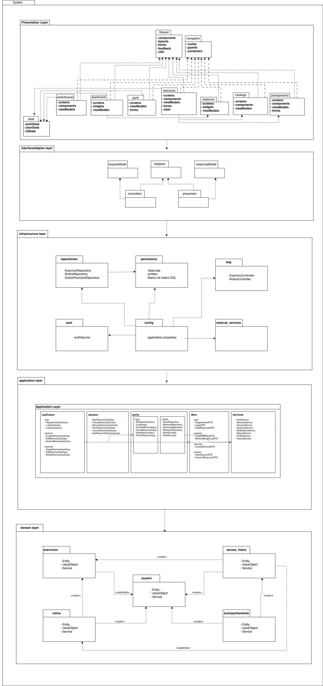
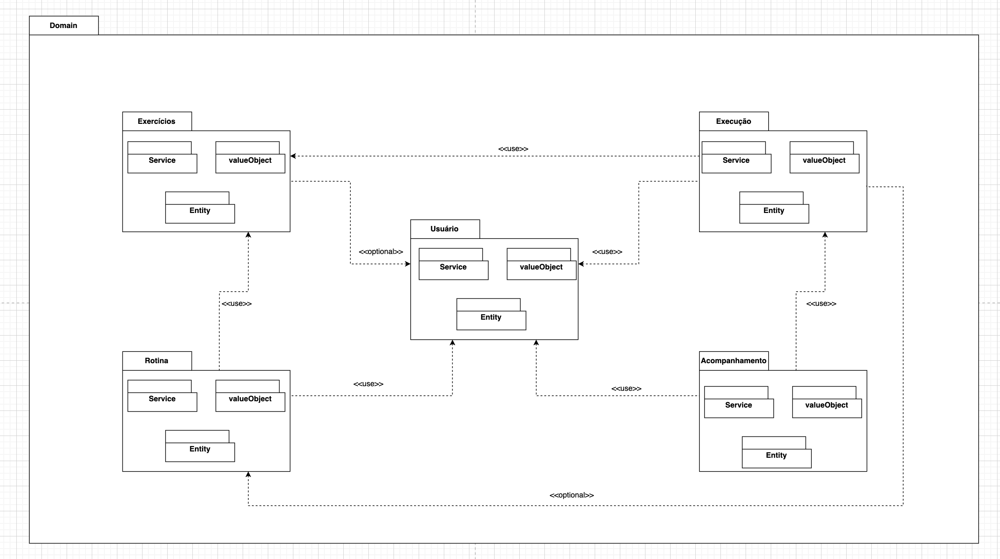

# 2.4. Modelagem Organizacional: Pastas

## 1. Metodologia

Optou-se pelo Diagrama de Pacotes para representar a estrutura modular do sistema em um nível de abstração mais alto do que o diagrama de classes, permitindo agrupar elementos semanticamente relacionados e explicitar dependências entre módulos.

Os artefatos visuais foram estruturados utilizando a ferramenta **DrawIO**, garantindo padronização, rastreabilidade via versionamento e, principalmente, um ambiente colaborativo.

## 2. Visão geral 

### 2.1 Objetivo

O foco desse diagrama é a representação do sistema em um nível mais alto de abstração, permitindo visualizar como as responsabilidades são distribuídas entre as camadas da aplicação e como cada pacote se relaciona com os demais. Em vez de listar classes individualmente, esse tipo de diagrama evidencia a divisão por contextos e fronteiras arquiteturais, o que facilita a compreensão do sistema como um todo.

No caso do projeto, mostra-se a separação entre Presentation Layer, InterfaceAdapter Layer, Infrastructure Layer, Application Layer e Domain Layer, refletindo uma organização alinhada a uma arquitetura em camadas e orientada à inversão de dependência. Assim, o foco deixa de ser somente a funcionalidade isolada e passa a ser a estrutura global do software, incluindo as responsabilidades da interface, da aplicação, da persistência e do núcleo de negócio.

### 2.2. Diagrama

### 2.2. Descrição

O diagrama completo mostra uma arquitetura organizada em cinco grandes blocos:

#### 2.2.1 Presentation Layer

É a camada mais externa voltada à interface com o usuário. Nela aparecem pacotes como autenticacao, dashboard, perfil, execucao, relatorios, catalogo e planejamento, além de pacotes compartilhados como shared, navigation e state.

Essa camada concentra as telas, componentes visuais, formulários, layouts, rotas, guards e estados da interface. Sua responsabilidade é apresentar informação, capturar interação e encaminhar ações para as camadas internas, sem conter regras centrais de negócio.

InterfaceAdapter Layer

Esta camada faz a mediação entre a interface e a aplicação. Os pacotes requestModel, mappers, responseModel, controllers e presenters indicam claramente a função de tradução entre os formatos usados pela interface e os formatos esperados pela camada de aplicação.

É aqui que os dados são adaptados, convertidos e preparados para circulação entre o mundo externo e os casos de uso. Isso é importante porque impede que a interface conheça detalhes internos da aplicação ou do domínio.

#### 2.2.2 Infrastructure Layer

A camada de infraestrutura reúne os aspectos técnicos e concretos do sistema: repositories, persistence, http, auth, config e external_services.

Essa camada concentra detalhes como acesso a banco, implementação de repositórios, configuração da aplicação, autenticação, comunicação HTTP e integração com serviços externos. Ela é deliberadamente periférica, pois serve de suporte às regras do sistema, não sendo o núcleo do negócio.

#### 2.2.3 Application Layer

A camada de aplicação organiza os casos de uso e suas dependências imediatas. No diagrama aparecem os pacotes useCases, session, ports, dtos e services.

Esse bloco é o responsável por orquestrar o comportamento do sistema. Ele recebe comandos da interface, aciona regras, coordena entidades e solicita persistência ou outros serviços por meio de portas. Em outras palavras, é a camada que transforma intenções do usuário em fluxos de execução concretos.

#### 2.2.4 Domain Layer

Na base do modelo está a Domain Layer, com os pacotes exercicios, usuario, rotina, sessao_treino e acompanhamento.

Esses pacotes representam o núcleo conceitual do sistema. Cada um está organizado com seus elementos centrais de negócio, como entidades, value objects e services. É também nessa camada que aparecem as dependências semânticas mais importantes do projeto: planejamento depende de exercícios e usuário; sessão depende de exercícios e pode depender de rotina de forma opcional; acompanhamento depende da sessão de treino.

#### 2.2.5 Estrutura interna geral

O modelo mostra ainda uma organização interna coerente em cada camada, com separação entre blocos de responsabilidade. Isso cria um mapa bem legível da arquitetura, evitando a mistura entre apresentação, aplicação, domínio e infraestrutura.

## 3. Presentation Layer

## 4. Infrastructure Layer

## 5. Application Layer

## 6. Domain Layer

### 6.1. Objetivo

Este "subdiagrama" organiza o núcleo das regras de negócio do sistema em pacotes de domínio coerentes, representando os principais contextos funcionais da aplicação: **usuario**, **exercicios**, **rotina**, **sessao_treino** e **acompanhamento**. A escolha por essa separação está em linha com a visão do produto e com os requisitos do sistema, que destacam onboarding e perfil, planejamento da rotina semanal, catálogo de exercícios, registro da sessão e acompanhamento por histórico e resumo semanal.

### 6.2. Diagrama

*Diagrama de Pacotes - Domain Layer. Autor: [João Nascimento](https://github.com/JMPNascimento) e [José Victor](https://github.com/RR2M4A).*

### 6.3. Descrição

Na modelagem proposta, o pacote **usuario** concentra as entidades e objetos de valor responsáveis pela identidade do usuário e pela classificação obtida no onboarding. O pacote **exercicios** reúne o catálogo de exercícios, com suas características descritivas. O pacote **rotina** contém os elementos de planejamento semanal, enquanto **sessao_treino** representa a sessão de treino executada de fato. Por fim, **acompanhamento** consolida as informações derivadas da sessão de treino, especialmente o resumo semanal e a constância do usuário.

Em termos de organização interna, cada pacote pode ser detalhado em três grupos: **entities**, **value objects** e **services**. Essa divisão deixa claro o que é dado do domínio, o que é regra de negócio e o que é comportamento derivado.

A dependência entre os pacotes segue uma lógica de uso real do domínio: **rotina** depende de **exercicios** e de **usuario**, pois a montagem da ficha semanal considera o perfil e os exercícios cadastrados; **sessao_treino** depende de **exercicios** e pode depender de **rotina** de forma opcional, pois o sistema permite sessão avulsa; **acompanhamento** depende de **sessao_treino**, porque o resumo semanal é calculado a partir das sessões concluídas.

## 7. Rastreabilidade e Elos com Outros Artefatos

Esse diagrama conversa diretamente com os demais artefatos do projeto.

- Com a visão do produto:

A visão do produto define que o sistema deve permitir organizar treinos, registrar execuções, acompanhar constância semanal e apoiar o onboarding por perfil. Esses objetivos aparecem distribuídos pelos pacotes principais da arquitetura, principalmente na divisão entre usuario, rotina, sessao_treino e acompanhamento.

- Com o backlog:

O backlog organiza o sistema em épicos, features e user stories. Essa organização aparece refletida nos pacotes da Presentation Layer, onde cada área funcional foi separada em subpacotes como autenticacao, perfil, execucao, catalogo, planejamento e relatorios.

- Com o diagrama de classes:

O diagrama de classes sustenta a Domain Layer, porque é nele que aparecem as entidades e relacionamentos centrais do domínio. A arquitetura em pacotes apenas reorganiza essas classes em blocos conceituais mais amplos, facilitando a leitura do núcleo do negócio.

- Com o diagrama de componentes:

O diagrama de componentes ajuda a explicar como os subsistemas se conectam e quais serviços são expostos externamente. Já o diagrama de pacotes detalha como isso se distribui internamente em camadas e módulos. Os dois se complementam: um mostra a estrutura macro de comunicação; o outro mostra a organização interna.

- Com o diagrama de estados e os diagramas dinâmicos:

O pacote sessao_treino se relaciona diretamente ao diagrama de estados da sessão, porque é ali que está o comportamento temporal da execução do treino. Da mesma forma, os fluxos dinâmicos de criação de rotina, registro de sessão e geração de resumo ajudam a justificar a distribuição dos pacotes de aplicação e domínio.

- Com a arquitetura limpa:

A estrutura em camadas do diagrama está em sintonia com a separação entre interface, aplicação, domínio e infraestrutura. Isso reforça o princípio de que as dependências devem caminhar das bordas para o centro e que o núcleo de regras de negócio deve permanecer protegido das decisões técnicas de interface e persistência.

## 8. Análise Crítica (Senso Crítico)

A principal vantagem desse diagrama é a clareza arquitetural. Em vez de tratar o sistema como uma lista de classes soltas, o modelo organiza o domínio em contextos que fazem sentido para o negócio. Isso melhora a manutenção, reduz acoplamento semântico e facilita a comunicação com a equipe, porque cada pacote passa a representar uma responsabilidade compreensível. Outro ponto forte é a boa rastreabilidade entre os artefatos. O que está no backlog reaparece como pacotes funcionais; o que está no diagrama de classes reaparece como domínio; o que está na dinâmica aparece associado aos pacotes de aplicação e comportamento. Essa coerência reduz ruído e fortalece a consistência da documentação. Há, porém, um ponto de atenção: a camada de apresentação tende a crescer bastante, porque concentra várias áreas funcionais e ainda possui pacotes compartilhados como shared, navigation e state. Isso é aceitável, mas exige disciplina para não transformar o pacote compartilhado em um “depósito genérico” de tudo que não cabe em outro lugar.

## 9. Referências

1. G7_MonitoreSeuTreino. **Documentação Base (Backlog, Léxico, Protótipo)**.
2. SERRANO, Milene. **Arquitetura e Desenho de Software - Aulas de Modelagem de Software**.

---

## Histórico de Versão

|  **Data**  | **Versão** | **Descrição**                                           |   **Autor**    | **Revisor** |
| :--------: | :--------: | :------------------------------------------------------ | :------------: | :---------: |
| 24/04/2026 |    1.0     | Estruturação inicial da página, adição da Visão geral e da Domain Layer  | João Nsscimento |      -      |
